02a_networks
================
Sglatt
2024-10-08

``` r
if (!require("bootnet")) {install.packages("bootnet"); require("bootnet")}
```

    ## Loading required package: bootnet

    ## Loading required package: ggplot2

    ## Warning: package 'ggplot2' was built under R version 4.3.3

    ## This is bootnet 1.5.6

    ## For questions and issues, please see github.com/SachaEpskamp/bootnet.

``` r
if (!require("dplyr")) {install.packages("dplyr"); require("dplyr")}
```

    ## Loading required package: dplyr

    ## 
    ## Attaching package: 'dplyr'

    ## The following objects are masked from 'package:stats':
    ## 
    ##     filter, lag

    ## The following objects are masked from 'package:base':
    ## 
    ##     intersect, setdiff, setequal, union

``` r
if (!require("EGAnet")) {install.packages("EGAnet"); require("EGAnet")}
```

    ## Loading required package: EGAnet

    ## 
    ## EGAnet (version 2.0.3) 
    ## 
    ## For help getting started, see <https://r-ega.net> 
    ## 
    ## For bugs and errors, submit an issue to <https://github.com/hfgolino/EGAnet/issues>

``` r
if (!require("foreign")) {install.packages("foreign"); require("foreign")}
```

    ## Loading required package: foreign

``` r
if (!require("ggpubr")) {install.packages("ggpubr"); require("ggpubr")}
```

    ## Loading required package: ggpubr

    ## Warning: package 'ggpubr' was built under R version 4.3.3

``` r
if (!require("ggplot2")) {install.packages("ggplot2"); require("ggplot2")}
if (!require("glmnet")) {install.packages("glmnet"); require("glmnet")}
```

    ## Loading required package: glmnet

    ## Loading required package: Matrix

    ## Loaded glmnet 4.1-8

``` r
if (!require("haven")) {install.packages("haven"); require("haven")}
```

    ## Loading required package: haven

``` r
if (!require("igraph")) {install.packages("igraph"); require("igraph")}
```

    ## Loading required package: igraph

    ## Warning: package 'igraph' was built under R version 4.3.3

    ## 
    ## Attaching package: 'igraph'

    ## The following object is masked from 'package:EGAnet':
    ## 
    ##     modularity

    ## The following objects are masked from 'package:dplyr':
    ## 
    ##     as_data_frame, groups, union

    ## The following objects are masked from 'package:stats':
    ## 
    ##     decompose, spectrum

    ## The following object is masked from 'package:base':
    ## 
    ##     union

``` r
if (!require("IsingFit")) {install.packages("IsingFit"); require("IsingFit")}
```

    ## Loading required package: IsingFit

``` r
if (!require("jmv")) {install.packages("jmv"); require("jmv")}
```

    ## Loading required package: jmv

``` r
if (!require("moments")) {install.packages("moments"); require("moments")}
```

    ## Loading required package: moments

``` r
if (!require("naniar")) {install.packages("naniar"); require("naniar")}
```

    ## Loading required package: naniar

    ## Warning: package 'naniar' was built under R version 4.3.3

``` r
if (!require("network")) {install.packages("network"); require("network")}
```

    ## Loading required package: network

    ## 
    ## 'network' 1.18.2 (2023-12-04), part of the Statnet Project
    ## * 'news(package="network")' for changes since last version
    ## * 'citation("network")' for citation information
    ## * 'https://statnet.org' for help, support, and other information

    ## 
    ## Attaching package: 'network'

    ## The following objects are masked from 'package:igraph':
    ## 
    ##     %c%, %s%, add.edges, add.vertices, delete.edges, delete.vertices,
    ##     get.edge.attribute, get.edges, get.vertex.attribute, is.bipartite,
    ##     is.directed, list.edge.attributes, list.vertex.attributes,
    ##     set.edge.attribute, set.vertex.attribute

``` r
if (!require("NetworkComparisonTest")) {install.packages("NetworkComparisonTest"); require("NetworkComparisonTest")}
```

    ## Loading required package: NetworkComparisonTest

``` r
if (!require("networktools")) {install.packages("networktools"); require("networktools")}
```

    ## Loading required package: networktools

    ## 
    ## Attaching package: 'networktools'

    ## The following object is masked from 'package:EGAnet':
    ## 
    ##     depression

``` r
if (!require("pcalg")) {install.packages("pcalg"); require("pcalg")}
```

    ## Loading required package: pcalg

``` r
if (!require("psych")) {install.packages("psych"); require("psych")}
```

    ## Loading required package: psych

    ## Warning: package 'psych' was built under R version 4.3.3

    ## 
    ## Attaching package: 'psych'

    ## The following objects are masked from 'package:jmv':
    ## 
    ##     pca, reliability

    ## The following objects are masked from 'package:ggplot2':
    ## 
    ##     %+%, alpha

``` r
if (!require("psychTools")) {install.packages("psychTools"); require("psychTools")}
```

    ## Loading required package: psychTools

    ## 
    ## Attaching package: 'psychTools'

    ## The following object is masked from 'package:dplyr':
    ## 
    ##     recode

``` r
if (!require("qgraph")) {install.packages("qgraph"); require("qgraph")}
```

    ## Loading required package: qgraph

``` r
if (!require("relaimpo")) {install.packages("relaimpo"); require("relaimpo")}
```

    ## Loading required package: relaimpo

    ## Loading required package: MASS

    ## 
    ## Attaching package: 'MASS'

    ## The following object is masked from 'package:dplyr':
    ## 
    ##     select

    ## Loading required package: boot

    ## 
    ## Attaching package: 'boot'

    ## The following object is masked from 'package:psych':
    ## 
    ##     logit

    ## Loading required package: survey

    ## Loading required package: grid

    ## Loading required package: survival

    ## 
    ## Attaching package: 'survival'

    ## The following object is masked from 'package:boot':
    ## 
    ##     aml

    ## 
    ## Attaching package: 'survey'

    ## The following object is masked from 'package:graphics':
    ## 
    ##     dotchart

    ## Loading required package: mitools

    ## This is the global version of package relaimpo.

    ## If you are a non-US user, a version with the interesting additional metric pmvd is available

    ## from Ulrike Groempings web site at prof.beuth-hochschule.de/groemping.

``` r
if (!require("stats")) {install.packages("stats"); require("stats")}
if (!require("tidyverse")) {install.packages("tidyverse"); require("tidyverse")}
```

    ## Loading required package: tidyverse

    ## Warning: package 'tidyr' was built under R version 4.3.3

    ## ── Attaching core tidyverse packages ──────────────────────── tidyverse 2.0.0 ──
    ## ✔ forcats   1.0.0     ✔ stringr   1.5.1
    ## ✔ lubridate 1.9.3     ✔ tibble    3.2.1
    ## ✔ purrr     1.0.2     ✔ tidyr     1.3.1
    ## ✔ readr     2.1.4

    ## ── Conflicts ────────────────────────────────────────── tidyverse_conflicts() ──
    ## ✖ lubridate::%--%()       masks igraph::%--%()
    ## ✖ psych::%+%()            masks ggplot2::%+%()
    ## ✖ psych::alpha()          masks ggplot2::alpha()
    ## ✖ tibble::as_data_frame() masks igraph::as_data_frame(), dplyr::as_data_frame()
    ## ✖ purrr::compose()        masks igraph::compose()
    ## ✖ tidyr::crossing()       masks igraph::crossing()
    ## ✖ tidyr::expand()         masks Matrix::expand()
    ## ✖ dplyr::filter()         masks stats::filter()
    ## ✖ dplyr::lag()            masks stats::lag()
    ## ✖ tidyr::pack()           masks Matrix::pack()
    ## ✖ psychTools::recode()    masks dplyr::recode()
    ## ✖ MASS::select()          masks dplyr::select()
    ## ✖ purrr::simplify()       masks igraph::simplify()
    ## ✖ tidyr::unpack()         masks Matrix::unpack()
    ## ℹ Use the conflicted package (<http://conflicted.r-lib.org/>) to force all conflicts to become errors

# Data and subsets

``` r
RESST_all <- read.csv("Created_data/RESST_merged_SG_2024-10-08.csv") # From "01a_data_processing"
colnames(RESST_all)
```

    ##  [1] "X"                       "workerID"               
    ##  [3] "Dataset"                 "R1"                     
    ##  [5] "R2"                      "R3"                     
    ##  [7] "R4"                      "R5"                     
    ##  [9] "R6"                      "R7"                     
    ## [11] "R8"                      "R9"                     
    ## [13] "R10"                     "R11"                    
    ## [15] "R12"                     "R13"                    
    ## [17] "R14"                     "R15"                    
    ## [19] "R16"                     "R17"                    
    ## [21] "R18"                     "R19"                    
    ## [23] "R20"                     "R21"                    
    ## [25] "Q45"                     "Q47"                    
    ## [27] "Q49"                     "Q51"                    
    ## [29] "Age"                     "Gender"                 
    ## [31] "Gender_other"            "Gender_TEXT"            
    ## [33] "Ethnicity"               "Ethnicity_TEXT"         
    ## [35] "Sexual_Orientation"      "Sexual_Orientation_TEXT"
    ## [37] "Marital_Status"          "Marital_Status_TEXT"    
    ## [39] "Employment"              "Education"              
    ## [41] "Income"                  "Military_status"        
    ## [43] "Military_discharge"      "Q45c"                   
    ## [45] "Q49c"                    "SBQR_total"             
    ## [47] "SA_group"

``` r
# RESST_all <- merged_3

RESST_all <- RESST_all %>%
  mutate(across(c(R1:R21), as.numeric))

RESST_items <- RESST_all %>%
  dplyr::select(R1:R21)

RESST_inv <- RESST_all %>%
  dplyr::select(R1:R21, SA_group)

RESST_time_inv <- read.csv("Created_data/RESST_3_week_long_form_SG_2024-09-29.csv") # From "01b_data_processing"
```

# Item descriptives

``` r
jmv::descriptives(
    data = RESST_all,
    vars = vars(R1, 
                R2, 
                R3, 
                R4, 
                R5, 
                R6, 
                R7, 
                R8,
                R9, 
                R10,
                R11, 
                R12, 
                R13, 
                R14, 
                R15,
                R16, 
                R17, 
                R18, 
                R19, 
                R20, 
                R21, 
                SBQR_total),
    min = FALSE,
    max = FALSE,
    skew = TRUE,
    kurt = TRUE)
```

    ## 
    ##  DESCRIPTIVES
    ## 
    ##  Descriptives                                                                                                                                                                                                                                                                                                                                  
    ##  ───────────────────────────────────────────────────────────────────────────────────────────────────────────────────────────────────────────────────────────────────────────────────────────────────────────────────────────────────────────────────────────────────────────────────────────────────────────────────────────────────────────── 
    ##                           R1            R2            R3            R4            R5            R6            R7            R8            R9            R10           R11           R12           R13           R14            R15           R16            R17           R18           R19           R20           R21           SBQR_total   
    ##  ───────────────────────────────────────────────────────────────────────────────────────────────────────────────────────────────────────────────────────────────────────────────────────────────────────────────────────────────────────────────────────────────────────────────────────────────────────────────────────────────────────────── 
    ##    N                             940           940           940           940           940           940           940           940           940           940           940           940           940            940           940            940           940           940           940           940           940           940   
    ##    Missing                         0             0             0             0             0             0             0             0             0             0             0             0             0              0             0              0             0             0             0             0             0             0   
    ##    Mean                     2.680851      2.938298      2.927660      3.088298      2.891489      2.881915      2.817021      3.403191      3.712766      4.026596      3.370213      3.250000      3.138298       3.045745      3.473404       3.107447      3.413830      3.458511      3.461702      3.496809      3.422340      10.23723   
    ##    Median                   3.000000      3.000000      3.000000      3.000000      3.000000      3.000000      3.000000      4.000000      4.000000      4.000000      3.000000      3.000000      3.000000       3.000000      4.000000       3.000000      4.000000      4.000000      4.000000      4.000000      4.000000      10.00000   
    ##    Standard deviation       1.281579      1.301437      1.253358      1.255307      1.271851      1.330358      1.249719      1.270703      1.270811      1.040365      1.264391      1.293158      1.332010       1.316332      1.250489       1.309484      1.266434      1.095728      1.135928      1.129048      1.180842      3.059248   
    ##    Skewness                0.2196322    0.04484197    0.02953041    -0.1346663    0.08282309    0.09486050     0.1261936    -0.3456681    -0.7254222    -0.9402893    -0.2877201    -0.2326329    -0.1488903    -0.04790206    -0.4192039    -0.09371863    -0.4157835    -0.3831988    -0.4053775    -0.4747862    -0.4282819     0.2206648   
    ##    Std. error skewness    0.07976645    0.07976645    0.07976645    0.07976645    0.07976645    0.07976645    0.07976645    0.07976645    0.07976645    0.07976645    0.07976645    0.07976645    0.07976645     0.07976645    0.07976645     0.07976645    0.07976645    0.07976645    0.07976645    0.07976645    0.07976645    0.07976645   
    ##    Kurtosis                -1.082375     -1.083093    -0.9676905    -0.9715092     -1.027183     -1.140492     -1.015059    -0.9520918    -0.5676910     0.2311263    -0.9476948     -1.047328     -1.144218      -1.113563    -0.8812160      -1.094442    -0.8555538    -0.5145361    -0.5944466    -0.4877500    -0.6491499    -0.2815346   
    ##    Std. error kurtosis     0.1593647     0.1593647     0.1593647     0.1593647     0.1593647     0.1593647     0.1593647     0.1593647     0.1593647     0.1593647     0.1593647     0.1593647     0.1593647      0.1593647     0.1593647      0.1593647     0.1593647     0.1593647     0.1593647     0.1593647     0.1593647     0.1593647   
    ##  ─────────────────────────────────────────────────────────────────────────────────────────────────────────────────────────────────────────────────────────────────────────────────────────────────────────────────────────────────────────────────────────────────────────────────────────────────────────────────────────────────────────────

# Exploratory graph analysis

``` r
# Standard EGA
RESST_ega <- EGA(data = RESST_items, 
                 corr = "auto", 
                 model = "glasso", 
                 algorithm = "walktrap",
                 uni.method = "louvain",
                 plot.EGA = TRUE,
                 verbose = TRUE)
```

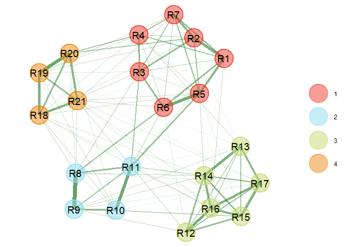<!-- -->

``` r
plot(RESST_ega, layout = "circle")
```

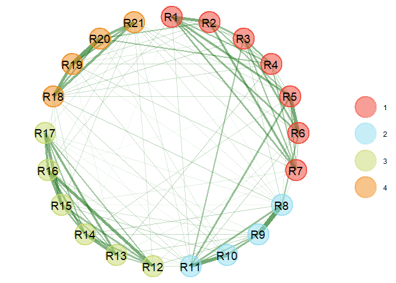<!-- -->

``` r
# Summary statistics about the EGA
summary(RESST_ega)
```

    ## Model: GLASSO (EBIC with gamma = 0.5)
    ## Correlations: auto
    ## Lambda: 0.0844462281616594 (n = 100, ratio = 0.1)
    ## 
    ## Number of nodes: 21
    ## Number of edges: 112
    ## Edge density: 0.533
    ## 
    ## Non-zero edge weights: 
    ##      M    SD   Min   Max
    ##  0.090 0.081 0.000 0.369
    ## 
    ## ----
    ## 
    ## Algorithm:  Walktrap
    ## 
    ## Number of communities:  4
    ## 
    ##  R1  R2  R3  R4  R5  R6  R7  R8  R9 R10 R11 R12 R13 R14 R15 R16 R17 R18 R19 R20 
    ##   1   1   1   1   1   1   1   2   2   2   2   3   3   3   3   3   3   4   4   4 
    ## R21 
    ##   4 
    ## 
    ## ----
    ## 
    ## Unidimensional Method: Louvain
    ## Unidimensional: No
    ## 
    ## ----
    ## 
    ## TEFI: -10.463

``` r
# Bootstrap EGA
set.seed(123456)
RESST_boot <- bootEGA(
  data = RESST_items, 
  corr = "auto", 
  model = "glasso", 
  algorithm = "walktrap",
  uni.method = "louvain",
  iter = 1000,
  seed = 123456, 
)
```

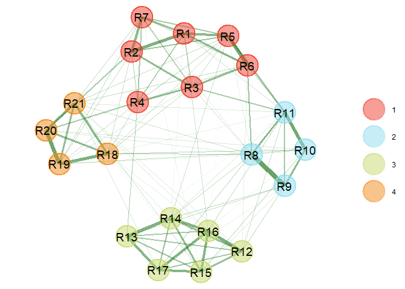<!-- -->

``` r
# Summary statistics about the bootstrap EGA
summary(RESST_boot)
```

    ## Model: GLASSO (EBIC)
    ## Correlations: auto
    ## Algorithm:  Walktrap
    ## Unidimensional Method:  Louvain
    ## 
    ## ----
    ## 
    ## EGA Type: EGA 
    ## Bootstrap Samples: 1000 (Parametric)
    ##              
    ##             4
    ## Frequency:  1
    ## 
    ## Median dimensions: 4 [4, 4] 95% CI

``` r
# Plots comparing the data EGA against 1000 bootsrapping procedure
RESST_compare <- compare.EGA.plots(RESST_ega, RESST_boot,
  labels = c("Empirical", "Bootstrap")
)
```

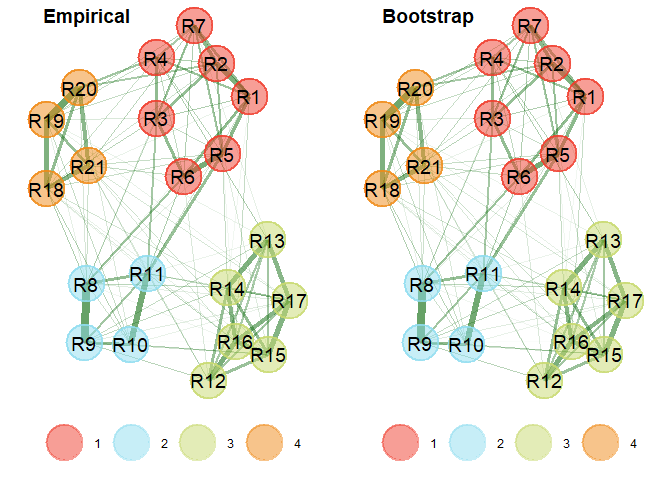<!-- -->

``` r
# Dimension stability
RESST_boot_dim <- dimensionStability(RESST_boot)
```

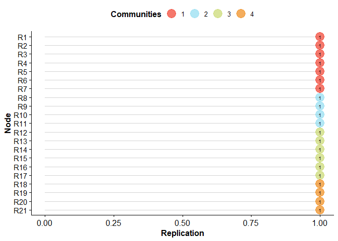<!-- -->

``` r
# where are the items going in the times that it isn't going in its dimension
RESST_boot_dim$item.stability$item.stability$all.dimensions
```

    ##     1 2 3 4
    ## R1  1 0 0 0
    ## R2  1 0 0 0
    ## R3  1 0 0 0
    ## R4  1 0 0 0
    ## R5  1 0 0 0
    ## R6  1 0 0 0
    ## R7  1 0 0 0
    ## R8  0 1 0 0
    ## R9  0 1 0 0
    ## R10 0 1 0 0
    ## R11 0 1 0 0
    ## R12 0 0 1 0
    ## R13 0 0 1 0
    ## R14 0 0 1 0
    ## R15 0 0 1 0
    ## R16 0 0 1 0
    ## R17 0 0 1 0
    ## R18 0 0 0 1
    ## R19 0 0 0 1
    ## R20 0 0 0 1
    ## R21 0 0 0 1

``` r
# Save output
pdf("Output/EGA_dimensions_size.pdf", width = 10, height = 10)
plot(RESST_ega, 
     color.palette = c("#33FFFF", "#FF3399", "#FFCC99", "#99ff99"), 
     node.size = colSums(RESST_ega$network)^2 * 16) 
dev.off() 
```

    ## png 
    ##   2

``` r
pdf("Output/EGA_dimensions.pdf", width = 10, height = 10)
plot(RESST_ega, 
     color.palette = c("#33FFFF", "#FF3399", "#FFCC99", "#99ff99"))  
dev.off() 
```

    ## png 
    ##   2

``` r
pdf("Output/EGA_empirical_boot.pdf", width = 10, height = 10)
(RESST_compare <- compare.EGA.plots(RESST_ega, RESST_boot,
  labels = c("Empirical", "Bootstrap")
))
```

    ## $all

    ## 
    ## $individual
    ## $individual[[1]]

    ## 
    ## $individual[[2]]

``` r
dev.off()
```

    ## png 
    ##   2

``` r
pdf("Output/EGA_dimension_stability.pdf", width = 10, height = 10)
dimensionStability(RESST_boot)
```

    ## EGA Type: EGA 
    ## Bootstrap Samples: 1000 (Parametric)
    ## 
    ## Proportion Replicated in Dimensions:
    ## 
    ##  R1  R2  R3  R4  R5  R6  R7  R8  R9 R10 R11 R12 R13 R14 R15 R16 R17 R18 R19 R20 
    ##   1   1   1   1   1   1   1   1   1   1   1   1   1   1   1   1   1   1   1   1 
    ## R21 
    ##   1 
    ## 
    ## ----
    ## 
    ## Structural Consistency:
    ## 
    ## 1 2 3 4 
    ## 1 1 1 1

``` r
dev.off()
```

    ## png 
    ##   2

# Prefer latent or network?

``` r
LCT(
  RESST_items,
  model = "glasso", 
  algorithm = "walktrap",
  uni.method = "louvain",
  iter = 100,
  seed = 123456,
)
```

    ##   |                                                                              |                                                                      |   0%  |                                                                              |=                                                                     |   1%  |                                                                              |=                                                                     |   2%  |                                                                              |==                                                                    |   3%  |                                                                              |===                                                                   |   4%  |                                                                              |====                                                                  |   5%  |                                                                              |====                                                                  |   6%  |                                                                              |=====                                                                 |   7%  |                                                                              |======                                                                |   8%  |                                                                              |======                                                                |   9%  |                                                                              |=======                                                               |  10%  |                                                                              |========                                                              |  11%  |                                                                              |========                                                              |  12%  |                                                                              |=========                                                             |  13%  |                                                                              |==========                                                            |  14%  |                                                                              |==========                                                            |  15%  |                                                                              |===========                                                           |  16%  |                                                                              |============                                                          |  17%  |                                                                              |=============                                                         |  18%  |                                                                              |=============                                                         |  19%  |                                                                              |==============                                                        |  20%  |                                                                              |===============                                                       |  21%  |                                                                              |===============                                                       |  22%  |                                                                              |================                                                      |  23%  |                                                                              |=================                                                     |  24%  |                                                                              |==================                                                    |  25%  |                                                                              |==================                                                    |  26%  |                                                                              |===================                                                   |  27%  |                                                                              |====================                                                  |  28%  |                                                                              |====================                                                  |  29%  |                                                                              |=====================                                                 |  30%  |                                                                              |======================                                                |  31%  |                                                                              |======================                                                |  32%  |                                                                              |=======================                                               |  33%  |                                                                              |========================                                              |  34%  |                                                                              |========================                                              |  35%  |                                                                              |=========================                                             |  36%  |                                                                              |==========================                                            |  37%  |                                                                              |===========================                                           |  38%  |                                                                              |===========================                                           |  39%  |                                                                              |============================                                          |  40%  |                                                                              |=============================                                         |  41%  |                                                                              |=============================                                         |  42%  |                                                                              |==============================                                        |  43%  |                                                                              |===============================                                       |  44%  |                                                                              |================================                                      |  45%  |                                                                              |================================                                      |  46%  |                                                                              |=================================                                     |  47%  |                                                                              |==================================                                    |  48%  |                                                                              |==================================                                    |  49%  |                                                                              |===================================                                   |  50%  |                                                                              |====================================                                  |  51%  |                                                                              |====================================                                  |  52%  |                                                                              |=====================================                                 |  53%  |                                                                              |======================================                                |  54%  |                                                                              |======================================                                |  55%  |                                                                              |=======================================                               |  56%  |                                                                              |========================================                              |  57%  |                                                                              |=========================================                             |  58%  |                                                                              |=========================================                             |  59%  |                                                                              |==========================================                            |  60%  |                                                                              |===========================================                           |  61%  |                                                                              |===========================================                           |  62%  |                                                                              |============================================                          |  63%  |                                                                              |=============================================                         |  64%  |                                                                              |==============================================                        |  65%  |                                                                              |==============================================                        |  66%  |                                                                              |===============================================                       |  67%  |                                                                              |================================================                      |  68%  |                                                                              |================================================                      |  69%  |                                                                              |=================================================                     |  70%  |                                                                              |==================================================                    |  71%  |                                                                              |==================================================                    |  72%  |                                                                              |===================================================                   |  73%  |                                                                              |====================================================                  |  74%  |                                                                              |====================================================                  |  75%  |                                                                              |=====================================================                 |  76%  |                                                                              |======================================================                |  77%  |                                                                              |=======================================================               |  78%  |                                                                              |=======================================================               |  79%  |                                                                              |========================================================              |  80%  |                                                                              |=========================================================             |  81%  |                                                                              |=========================================================             |  82%  |                                                                              |==========================================================            |  83%  |                                                                              |===========================================================           |  84%  |                                                                              |============================================================          |  85%  |                                                                              |============================================================          |  86%  |                                                                              |=============================================================         |  87%  |                                                                              |==============================================================        |  88%  |                                                                              |==============================================================        |  89%  |                                                                              |===============================================================       |  90%  |                                                                              |================================================================      |  91%  |                                                                              |================================================================      |  92%  |                                                                              |=================================================================     |  93%  |                                                                              |==================================================================    |  94%  |                                                                              |==================================================================    |  95%  |                                                                              |===================================================================   |  96%  |                                                                              |====================================================================  |  97%  |                                                                              |===================================================================== |  98%  |                                                                              |===================================================================== |  99%  |                                                                              |======================================================================| 100%

    ## $empirical
    ## [1] "Network"
    ## 
    ## $bootstrap
    ## [1] "Network"
    ## 
    ## $proportion
    ##  Factor Network 
    ##       0       1

# EGA Suicide attempt invariance

``` r
# network for people with SA history 
RESST_inv <- RESST_inv %>%
  mutate(SA_group_f = ifelse(SA_group == 1, "SA+", "SA-"))
table(RESST_inv$SA_group)
```

    ## 
    ##   0   1 
    ## 613 327

``` r
table(RESST_inv$SA_group_f)
```

    ## 
    ## SA- SA+ 
    ## 613 327

``` r
RESST_ega_SA <- bootEGA(
  data = RESST_inv[RESST_inv$SA_group_f == "SA+", 1:21],
  corr = "auto",
  model = "glasso",
  algorithm = "walktrap",
  uni.method =  "louvain",
  iter = 1000,
  type = "parametric",
  ncores = 4,
  typicalStructure = TRUE,
  plot.typicalStructure = TRUE,
  seed = 123456,
  verbose = TRUE,
)
```

<!-- -->

``` r
RESST_ega_no_SA <- bootEGA(
  data = RESST_inv[RESST_inv$SA_group_f == "SA-", 1:21],
  corr = "auto",
  model = "glasso",
  algorithm = "walktrap",
  uni.method =  "louvain",
  iter = 1000,
  type = "parametric",
  ncores = 4,
  typicalStructure = TRUE,
  plot.typicalStructure = TRUE,
  seed = 123456,
  verbose = TRUE,
)
```

<!-- -->

``` r
plot(RESST_ega_no_SA)
```

<!-- -->

``` r
plot(RESST_ega_SA)
```

<!-- -->

``` r
# look at item/dimension stability in the SA/no SA networks 
RESST_ega_SA_dim <- itemStability(RESST_ega_SA)
```

<!-- -->

``` r
RESST_ega_no_SA_dim <- itemStability(RESST_ega_no_SA)
```

<!-- -->

``` r
# compare bootstrapped between group networks of SA
igraph::compare(RESST_ega_SA$wc, RESST_ega_no_SA$wc, method = "nmi")
```

    ## [1] 1

``` r
# compute the normalized mutual information between the wc objects (risk vs. no risk)
# value of 1 meaning identical. if it is 1, you have established configural invariance 

# metric invariance by SA status
metric_inv_SA <- invariance(data = RESST_inv[,1:21],
                             groups = RESST_inv$SA_group_f, 
                             configural.threshold = 0.7, 
                             configural.type = "parametric",
                             corr = "auto",
                             model = "glasso", 
                             algorithm =  "walktrap", 
                             uni.method = "louvain",
                             iter = 1000,
                             gamma = 0, 
                             ncores = 4,
                             seed = 123456)
```

    ## Testing configural invariance...

    ## 
    ## Configural invariance was found with 21 variables

    ## Testing metric invariance...

``` r
(RESST_metric_invariance_fig <- plot(metric_inv_SA))
```

<!-- -->

``` r
(RESST_metric_invariance_crc_fig <- plot(metric_inv_SA,layout = "circle"))
```

<!-- -->

``` r
# Benjamin-Hochberg procedure to adjust p's for multiple comparisons
adjusted.p <- p.adjust(
  metric_inv_SA$results$p, method = "BH",
  n = length(metric_inv_SA$results$p)
)

metric_inv_SA$results[metric_inv_SA$results$p < .05,] # Uncorrected p
```

    ##     Membership Difference    p p_BH sig Direction
    ## R19          4       -0.1 0.03 0.63   * SA- < SA+

``` r
metric_inv_SA$results[adjusted.p < .05,] # corrected p
```

    ## [1] Membership Difference p          p_BH       sig        Direction 
    ## <0 rows> (or 0-length row.names)

``` r
# figures 
pdf("Output/Invariance_SA-_dimensions.pdf", width = 5, height = 5)
dimensionStability(RESST_ega_no_SA)
```

    ## EGA Type: EGA 
    ## Bootstrap Samples: 1000 (Parametric)
    ## 
    ## Proportion Replicated in Dimensions:
    ## 
    ##  R1  R2  R3  R4  R5  R6  R7  R8  R9 R10 R11 R12 R13 R14 R15 R16 R17 R18 R19 R20 
    ##   1   1   1   1   1   1   1   1   1   1   1   1   1   1   1   1   1   1   1   1 
    ## R21 
    ##   1 
    ## 
    ## ----
    ## 
    ## Structural Consistency:
    ## 
    ## 1 2 3 4 
    ## 1 1 1 1

``` r
dev.off()
```

    ## png 
    ##   2

``` r
pdf("Output/Invariance_SA+_dimensions.pdf", width = 5, height = 5)
dimensionStability(RESST_ega_SA)
```

    ## EGA Type: EGA 
    ## Bootstrap Samples: 1000 (Parametric)
    ## 
    ## Proportion Replicated in Dimensions:
    ## 
    ##    R1    R2    R3    R4    R5    R6    R7    R8    R9   R10   R11   R12   R13 
    ## 1.000 1.000 1.000 0.961 1.000 0.998 1.000 0.999 1.000 1.000 1.000 1.000 1.000 
    ##   R14   R15   R16   R17   R18   R19   R20   R21 
    ## 1.000 1.000 1.000 1.000 0.999 1.000 1.000 0.999 
    ## 
    ## ----
    ## 
    ## Structural Consistency:
    ## 
    ##     1     2     3     4 
    ## 0.959 0.999 1.000 0.998

``` r
dev.off()
```

    ## png 
    ##   2

``` r
pdf("Output/Invariance_SA.pdf", width = 10, height = 10)
RESST_metric_invariance_fig
dev.off()
```

    ## png 
    ##   2

``` r
pdf("Output/Invariance_SA_circle.pdf", width = 10, height = 10)
RESST_metric_invariance_crc_fig
dev.off()
```

    ## png 
    ##   2

# EGA 21 day invariance

``` r
T1_T2_RESST_inv <- invariance(data = RESST_time_inv[,3:23],
                             groups = RESST_time_inv$Timepoint, 
                             configural.threshold = 0.7, 
                             configural.type = "parametric",
                             corr = "auto",
                             model = "glasso", 
                             algorithm =  "walktrap", 
                             uni.method = "louvain",
                             iter = 1000,
                             gamma = 0, 
                             ncores = 4,
                             seed = 123456)
```

    ## Warning: Several variables were coerced to numeric values. These variables were changed to numeric values:
    ## 'Timepoint'

    ## Testing configural invariance...

    ## 
    ## Configural invariance was found with 20 variables

    ## Testing metric invariance...

``` r
(T1_T2_RESST_inv_fig <- plot(T1_T2_RESST_inv))
```

<!-- -->

``` r
(T1_T2_RESST_inv_crc_fig <- plot(T1_T2_RESST_inv,layout = "circle"))
```

<!-- -->

``` r
# Benjamin-Hochberg procedure to adjust p's for multiple comparisons 
(adjusted.p <- p.adjust(T1_T2_RESST_inv$results$p, method = "BH",
                       n = length(T1_T2_RESST_inv$results$p))) # corrected p 
```

    ##  [1] 0.6945455 0.6945455 0.9890000 0.6945455 0.9789474 0.6945455 0.8416667
    ##  [8] 0.6945455 0.8906667 0.6945455 0.9789474 0.6945455 0.8906667 0.8906667
    ## [15] 0.6945455 0.6945455 0.6945455 0.6945455 0.9212500 0.9247059

``` r
(unadjusted.p <- T1_T2_RESST_inv$results[T1_T2_RESST_inv$results$p < .05,]) # uncorrected p 
```

    ## [1] Membership Difference p          p_BH       sig        Direction 
    ## <0 rows> (or 0-length row.names)

``` r
# figures
pdf("Output/Invariance_3week.pdf", width = 10, height = 6)
T1_T2_RESST_inv_fig
dev.off()
```

    ## png 
    ##   2

``` r
pdf("Output/Invariance_3week_circle.pdf", width = 10, height = 6)
T1_T2_RESST_inv_crc_fig
dev.off()
```

    ## png 
    ##   2

# EBIC network

``` r
# fit network
RESST_Network_eg <- estimateNetwork(RESST_items, default = "EBICglasso")
```

    ## Estimating Network. Using package::function:
    ##   - qgraph::EBICglasso for EBIC model selection
    ##     - using glasso::glasso

    ## Warning in EBICglassoCore(S = S, n = n, gamma = gamma, penalize.diagonal =
    ## penalize.diagonal, : A dense regularized network was selected (lambda < 0.1 *
    ## lambda.max). Recent work indicates a possible drop in specificity. Interpret
    ## the presence of the smallest edges with care. Setting threshold = TRUE will
    ## enforce higher specificity, at the cost of sensitivity.

``` r
# make a community structure 
groupsint = list("self-worth" = c(1:7),
                 "life worth" = c(8:11), 
                 "social worth" = c(12:17),
                 "self-understanding" = c(18:21)) 

network_RESST_comm <- plot(RESST_Network_eg, 
                           groups = groupsint, color=c("lightcoral", "slategray2", "darkseagreen", "#FF99FF"),
                           layout = "spring", labels = TRUE)
```

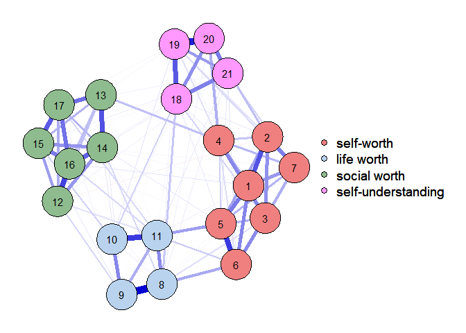<!-- -->

``` r
# centralities - regular
(cen_tab = centralityTable(RESST_Network_eg, standardized = TRUE))
```

    ##      graph type node           measure       value
    ## 1  graph 1   NA   R1       Betweenness -0.26549505
    ## 2  graph 1   NA   R2       Betweenness -0.03946548
    ## 3  graph 1   NA   R3       Betweenness -0.41618143
    ## 4  graph 1   NA   R4       Betweenness  2.67288934
    ## 5  graph 1   NA   R5       Betweenness -0.26549505
    ## 6  graph 1   NA   R6       Betweenness  0.11122090
    ## 7  graph 1   NA   R7       Betweenness -0.94358375
    ## 8  graph 1   NA   R8       Betweenness  0.71396641
    ## 9  graph 1   NA   R9       Betweenness -0.64221100
    ## 10 graph 1   NA  R10       Betweenness -0.19015186
    ## 11 graph 1   NA  R11       Betweenness  0.03587771
    ## 12 graph 1   NA  R12       Betweenness -0.86824056
    ## 13 graph 1   NA  R13       Betweenness  2.14548702
    ## 14 graph 1   NA  R14       Betweenness  0.71396641
    ## 15 graph 1   NA  R15       Betweenness -0.49152462
    ## 16 graph 1   NA  R16       Betweenness -0.79289738
    ## 17 graph 1   NA  R17       Betweenness -0.86824056
    ## 18 graph 1   NA  R18       Betweenness -0.03946548
    ## 19 graph 1   NA  R19       Betweenness -0.94358375
    ## 20 graph 1   NA  R20       Betweenness  1.24136874
    ## 21 graph 1   NA  R21       Betweenness -0.86824056
    ## 22 graph 1   NA   R1         Closeness  0.79841918
    ## 23 graph 1   NA   R2         Closeness  0.18263198
    ## 24 graph 1   NA   R3         Closeness  1.35295479
    ## 25 graph 1   NA   R4         Closeness  1.87153772
    ## 26 graph 1   NA   R5         Closeness  0.50715670
    ## 27 graph 1   NA   R6         Closeness  0.31091442
    ## 28 graph 1   NA   R7         Closeness -0.19610170
    ## 29 graph 1   NA   R8         Closeness  1.18760592
    ## 30 graph 1   NA   R9         Closeness  0.32202299
    ## 31 graph 1   NA  R10         Closeness  0.89890571
    ## 32 graph 1   NA  R11         Closeness  1.19074382
    ## 33 graph 1   NA  R12         Closeness -1.73600600
    ## 34 graph 1   NA  R13         Closeness -0.05210781
    ## 35 graph 1   NA  R14         Closeness -0.49961641
    ## 36 graph 1   NA  R15         Closeness -1.30661400
    ## 37 graph 1   NA  R16         Closeness -1.21630295
    ## 38 graph 1   NA  R17         Closeness -0.85783294
    ## 39 graph 1   NA  R18         Closeness -0.71772969
    ## 40 graph 1   NA  R19         Closeness -0.70014960
    ## 41 graph 1   NA  R20         Closeness -0.04916525
    ## 42 graph 1   NA  R21         Closeness -1.29126689
    ## 43 graph 1   NA   R1          Strength  0.66446989
    ## 44 graph 1   NA   R2          Strength  0.35406955
    ## 45 graph 1   NA   R3          Strength  0.04091988
    ## 46 graph 1   NA   R4          Strength -0.72948669
    ## 47 graph 1   NA   R5          Strength  1.24836611
    ## 48 graph 1   NA   R6          Strength  0.54177577
    ## 49 graph 1   NA   R7          Strength -0.63670623
    ## 50 graph 1   NA   R8          Strength  0.16937441
    ## 51 graph 1   NA   R9          Strength -1.02520752
    ## 52 graph 1   NA  R10          Strength -2.60385429
    ## 53 graph 1   NA  R11          Strength  1.61269020
    ## 54 graph 1   NA  R12          Strength -0.25832188
    ## 55 graph 1   NA  R13          Strength -0.59710875
    ## 56 graph 1   NA  R14          Strength  1.03288185
    ## 57 graph 1   NA  R15          Strength  0.27616121
    ## 58 graph 1   NA  R16          Strength  1.51824234
    ## 59 graph 1   NA  R17          Strength  0.18920982
    ## 60 graph 1   NA  R18          Strength  0.06281076
    ## 61 graph 1   NA  R19          Strength -0.07329895
    ## 62 graph 1   NA  R20          Strength -0.31549231
    ## 63 graph 1   NA  R21          Strength -1.47149517
    ## 64 graph 1   NA   R1 ExpectedInfluence  0.71602176
    ## 65 graph 1   NA   R2 ExpectedInfluence -0.06639314
    ## 66 graph 1   NA   R3 ExpectedInfluence  0.10119909
    ## 67 graph 1   NA   R4 ExpectedInfluence -0.65842470
    ## 68 graph 1   NA   R5 ExpectedInfluence  1.29174564
    ## 69 graph 1   NA   R6 ExpectedInfluence  0.59504489
    ## 70 graph 1   NA   R7 ExpectedInfluence -0.56694281
    ## 71 graph 1   NA   R8 ExpectedInfluence  0.22785575
    ## 72 graph 1   NA   R9 ExpectedInfluence -1.11259290
    ## 73 graph 1   NA  R10 ExpectedInfluence -2.50655824
    ## 74 graph 1   NA  R11 ExpectedInfluence  1.65097057
    ## 75 graph 1   NA  R12 ExpectedInfluence -0.58938617
    ## 76 graph 1   NA  R13 ExpectedInfluence -0.52789955
    ## 77 graph 1   NA  R14 ExpectedInfluence  1.07927734
    ## 78 graph 1   NA  R15 ExpectedInfluence  0.33314793
    ## 79 graph 1   NA  R16 ExpectedInfluence  1.55784463
    ## 80 graph 1   NA  R17 ExpectedInfluence  0.16658631
    ## 81 graph 1   NA  R18 ExpectedInfluence  0.12278359
    ## 82 graph 1   NA  R19 ExpectedInfluence -0.17400745
    ## 83 graph 1   NA  R20 ExpectedInfluence -0.25022468
    ## 84 graph 1   NA  R21 ExpectedInfluence -1.39004787

``` r
cen_tab_strength = subset(cen_tab, measure == "Strength")
cen_tab_strength
```

    ##      graph type node  measure       value
    ## 43 graph 1   NA   R1 Strength  0.66446989
    ## 44 graph 1   NA   R2 Strength  0.35406955
    ## 45 graph 1   NA   R3 Strength  0.04091988
    ## 46 graph 1   NA   R4 Strength -0.72948669
    ## 47 graph 1   NA   R5 Strength  1.24836611
    ## 48 graph 1   NA   R6 Strength  0.54177577
    ## 49 graph 1   NA   R7 Strength -0.63670623
    ## 50 graph 1   NA   R8 Strength  0.16937441
    ## 51 graph 1   NA   R9 Strength -1.02520752
    ## 52 graph 1   NA  R10 Strength -2.60385429
    ## 53 graph 1   NA  R11 Strength  1.61269020
    ## 54 graph 1   NA  R12 Strength -0.25832188
    ## 55 graph 1   NA  R13 Strength -0.59710875
    ## 56 graph 1   NA  R14 Strength  1.03288185
    ## 57 graph 1   NA  R15 Strength  0.27616121
    ## 58 graph 1   NA  R16 Strength  1.51824234
    ## 59 graph 1   NA  R17 Strength  0.18920982
    ## 60 graph 1   NA  R18 Strength  0.06281076
    ## 61 graph 1   NA  R19 Strength -0.07329895
    ## 62 graph 1   NA  R20 Strength -0.31549231
    ## 63 graph 1   NA  R21 Strength -1.47149517

``` r
# centralityPlot(RESST_Network_eg, include = "all", scale = "raw", orderBy = "ExpectedInfluence")
centralityPlot(RESST_Network_eg, include = "all", scale = "z-scores", orderBy = "ExpectedInfluence")
```

    ## Note: z-scores are shown on x-axis rather than raw centrality indices.

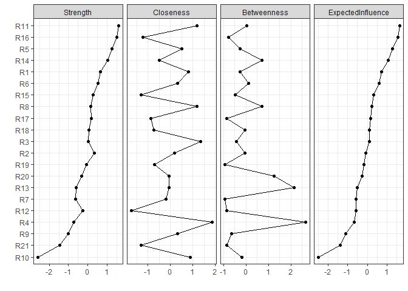<!-- -->

``` r
# centralities - bridge
(intbridge <- bridge(network_RESST_comm,
                    communities = c('1','1','1','1','1','1','1',
                                    '2','2','2','2',
                                    '3','3','3','3', '3', '3', 
                                    '4', '4', '4', '4'),
                    useCommunities = "all", 
                    directed = NULL,   
                    normalize = FALSE,
                    nodes = NULL))
```

    ## $`Bridge Strength`
    ##          1          2          3          4          5          6          7 
    ## 0.07410676 0.19387564 0.22885936 0.29013951 0.26843357 0.26056890 0.15129839 
    ##          8          9         10         11         12         13         14 
    ## 0.41838864 0.19502281 0.19801724 0.56614526 0.16842565 0.14927500 0.18854551 
    ##         15         16         17         18         19         20         21 
    ## 0.16296500 0.14274800 0.11118613 0.38253125 0.24351868 0.25119873 0.28569407 
    ## 
    ## $`Bridge Betweenness`
    ##  1  2  3  4  5  6  7  8  9 10 11 12 13 14 15 16 17 18 19 20 21 
    ##  7 11  6 48  9 13  0 22  3 10 13  1 40 20  6  2  1 12  0 29  1 
    ## 
    ## $`Bridge Closeness`
    ##          1          2          3          4          5          6          7 
    ## 0.04916798 0.04610930 0.05381531 0.06096114 0.04872577 0.04751952 0.04471271 
    ##          8          9         10         11         12         13         14 
    ## 0.05768553 0.05211489 0.05593472 0.05786052 0.03626468 0.04664140 0.04302900 
    ##         15         16         17         18         19         20         21 
    ## 0.03841158 0.03840204 0.04098441 0.04542003 0.04532602 0.04941050 0.04205027 
    ## 
    ## $`Bridge Expected Influence (1-step)`
    ##          1          2          3          4          5          6          7 
    ## 0.07410676 0.14241596 0.22885936 0.29013951 0.26843357 0.26056890 0.15129839 
    ##          8          9         10         11         12         13         14 
    ## 0.41838864 0.17745908 0.19801724 0.56614526 0.12569751 0.14927500 0.18854551 
    ##         15         16         17         18         19         20         21 
    ## 0.16296500 0.14274800 0.10245460 0.38253125 0.22595495 0.25119873 0.28569407 
    ## 
    ## $`Bridge Expected Influence (2-step)`
    ##         1         2         3         4         5         6         7         8 
    ## 0.3526258 0.3869084 0.5598670 0.6177896 0.6394678 0.6173462 0.4085105 0.9361932 
    ##         9        10        11        12        13        14        15        16 
    ## 0.5838648 0.5694254 1.2134859 0.3374335 0.3761493 0.4807347 0.3894977 0.4162067 
    ##        17        18        19        20        21 
    ## 0.3219676 0.8436576 0.6079891 0.6217374 0.7024370 
    ## 
    ## $communities
    ##  [1] "1" "1" "1" "1" "1" "1" "1" "2" "2" "2" "2" "3" "3" "3" "3" "3" "3" "4" "4"
    ## [20] "4" "4"

``` r
plot(intbridge, zscore = TRUE, color = TRUE)
```

    ## Warning: Vectorized input to `element_text()` is not officially supported.
    ## ℹ Results may be unexpected or may change in future versions of ggplot2.

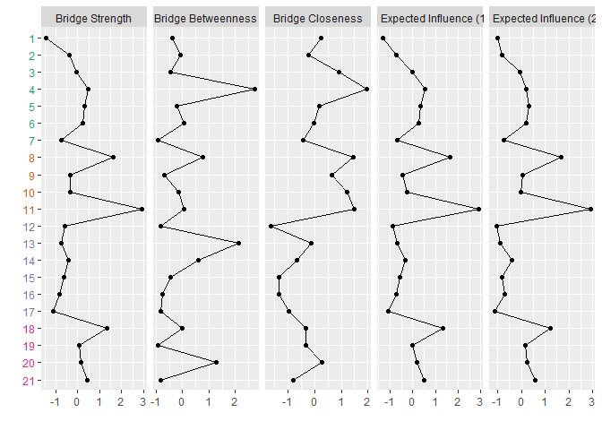<!-- -->

``` r
# Just EI
out1 <- expectedInf(network_RESST_comm) 
plot(out1, order = "value", color = TRUE, zscore = TRUE)
```

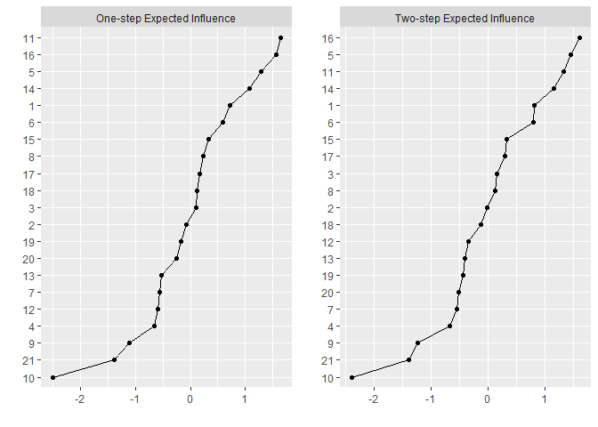<!-- -->

``` r
# Centrality stability 
set.seed(123456)
All_boot_case <- bootnet(RESST_Network_eg,
                         communities = c('1','1','1','1','1','1','1',
                                         '2','2','2','2',
                                         '3','3','3','3', '3', '3', 
                                         '4', '4', '4', '4'), 
                         nBoots = 1000, 
                         nCores = 4, 
                         type = "case",
                         statistics = c('betweenness', 'closeness', 'expectedInfluence', 
                                        'BridgeStrength', 'bridgeExpectedInfluence', 'strength', 
                                        'edge'))
```

    ## Note: bootnet will store only the following statistics:  betweenness, closeness, expectedInfluence, BridgeStrength, bridgeExpectedInfluence, strength, edge

    ## Bootstrapping...

    ## Computing statistics...

``` r
All_boot_case$bootTable
```

    ## # A tibble: 336,000 × 12
    ##    name  type  node1 node2  value id    nNode nPerson rank_avg rank_min rank_max
    ##    <chr> <chr> <chr> <chr>  <dbl> <chr> <int>   <int>    <dbl>    <int>    <int>
    ##  1 boot… edge  R1    R2    0.271  R1--…    21     747      205      205      205
    ##  2 boot… edge  R1    R3    0.0594 R1--…    21     747      155      155      155
    ##  3 boot… edge  R2    R3    0.186  R2--…    21     747      192      192      192
    ##  4 boot… edge  R1    R4    0.130  R1--…    21     747      180      180      180
    ##  5 boot… edge  R2    R4    0.0557 R2--…    21     747      154      154      154
    ##  6 boot… edge  R3    R4    0.183  R3--…    21     747      191      191      191
    ##  7 boot… edge  R1    R5    0.202  R1--…    21     747      200      200      200
    ##  8 boot… edge  R2    R5    0.144  R2--…    21     747      184      184      184
    ##  9 boot… edge  R3    R5    0.0464 R3--…    21     747      147      147      147
    ## 10 boot… edge  R4    R5    0.0429 R4--…    21     747      143      143      143
    ## # ℹ 335,990 more rows
    ## # ℹ 1 more variable: graph <chr>

``` r
plot(All_boot_case, 'all')
```

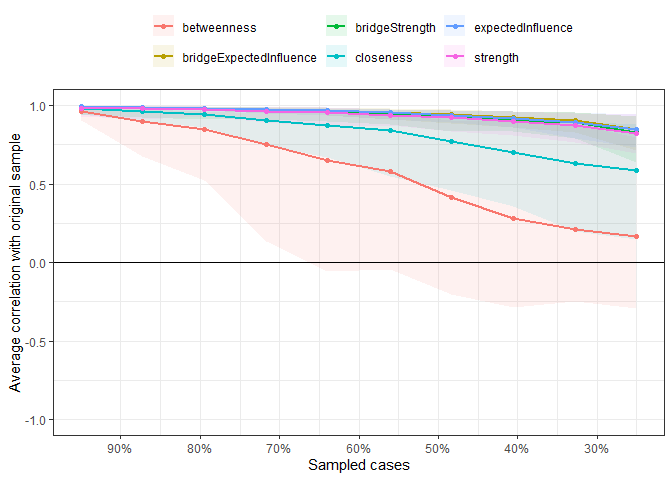<!-- -->

``` r
corStability(All_boot_case)
```

    ## === Correlation Stability Analysis === 
    ## 
    ## Sampling levels tested:
    ##    nPerson Drop%   n
    ## 1      235  75.0  96
    ## 2      308  67.2  99
    ## 3      381  59.5  84
    ## 4      454  51.7  89
    ## 5      527  43.9 112
    ## 6      601  36.1  90
    ## 7      674  28.3 109
    ## 8      747  20.5 113
    ## 9      820  12.8  95
    ## 10     893   5.0 113
    ## 
    ## Maximum drop proportions to retain correlation of 0.7 in at least 95% of the samples:
    ## 
    ## betweenness: 0.128 
    ##   - For more accuracy, run bootnet(..., caseMin = 0.05, caseMax = 0.205) 
    ## 
    ## bridgeExpectedInfluence: 0.75 (CS-coefficient is highest level tested)
    ##   - For more accuracy, run bootnet(..., caseMin = 0.672, caseMax = 1) 
    ## 
    ## bridgeStrength: 0.672 
    ##   - For more accuracy, run bootnet(..., caseMin = 0.595, caseMax = 0.75) 
    ## 
    ## closeness: 0.361 
    ##   - For more accuracy, run bootnet(..., caseMin = 0.283, caseMax = 0.439) 
    ## 
    ## edge: 0.75 (CS-coefficient is highest level tested)
    ##   - For more accuracy, run bootnet(..., caseMin = 0.672, caseMax = 1) 
    ## 
    ## expectedInfluence: 0.75 (CS-coefficient is highest level tested)
    ##   - For more accuracy, run bootnet(..., caseMin = 0.672, caseMax = 1) 
    ## 
    ## strength: 0.75 (CS-coefficient is highest level tested)
    ##   - For more accuracy, run bootnet(..., caseMin = 0.672, caseMax = 1) 
    ## 
    ## Accuracy can also be increased by increasing both 'nBoots' and 'caseN'.

``` r
# edge stability 
set.seed(123456)
All_boot <- bootnet(RESST_Network_eg,
                    nBoots = 1000, 
                    nCores = 4,
                    type = "nonparametric", 
                    statistics = c('betweenness', 'closeness', 'expectedInfluence', 'strength', 'edge'))
```

    ## Note: bootnet will store only the following statistics:  betweenness, closeness, expectedInfluence, strength, edge

    ## Bootstrapping...

    ## Computing statistics...

``` r
# Plot network from bootnet (some edges set to 0)
boot_network_eg <- bootThreshold(All_boot, alpha = 0.05, verbose = TRUE, thresholdIntercepts = FALSE)
```

    ## Expected significance level given number of bootstrap samples is approximately: 0.05

``` r
plot(boot_network_eg)
```

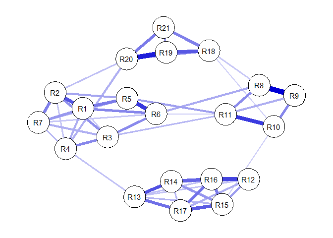<!-- -->

``` r
plot(All_boot, labels = TRUE, order = "sample") 
```

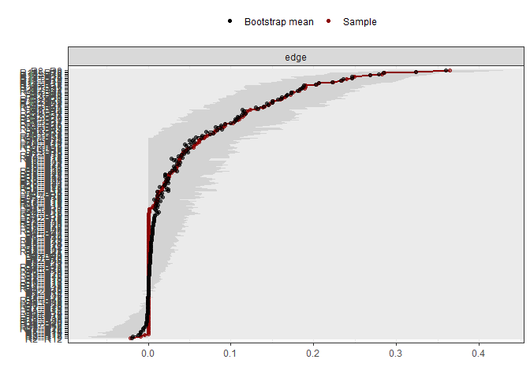<!-- -->

``` r
(edge_diff_plot <- plot(All_boot, "edge", plot = "difference", onlyNonZero = TRUE, order = "sample"))
```

    ## Expected significance level given number of bootstrap samples is approximately: 0.05

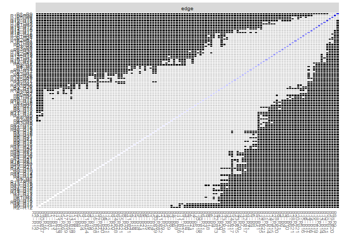<!-- -->

``` r
# for regularized, this is interpreted differently.regularization causes all edge-estimates to be biased towards zero, which implies that all sampling distributions are biased towards zero. so these sampling distributions are not CIs centered on the true (unbiased) parameter value. This means that if the quantiles of the bootstrapped sampling distribution overlap with zero it could be that the corresponding CI *does not* overlap with zero. However, if the quantiles of the bootstrapped sampling distribution do not overlap with zero, we know that also the corresponding CI does not overlap with zero
plot(All_boot, plot = "interval", split0 = TRUE, order = "sample", labels = FALSE)
```

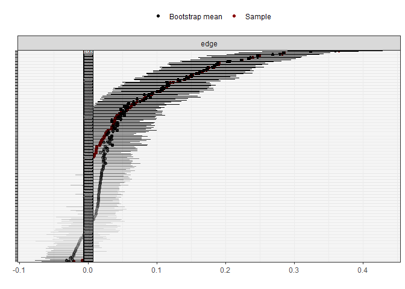<!-- -->

``` r
# Centrality difference tests

plot(All_boot, "strength", order = "sample", labels = TRUE) 
```

    ## Expected significance level given number of bootstrap samples is approximately: 0.05

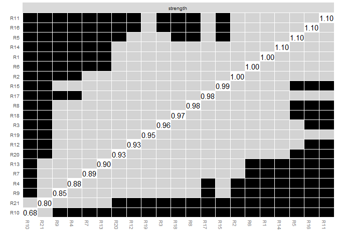<!-- -->

``` r
plot(All_boot, "expectedInfluence", order = "sample", labels = TRUE) 
```

    ## Expected significance level given number of bootstrap samples is approximately: 0.05

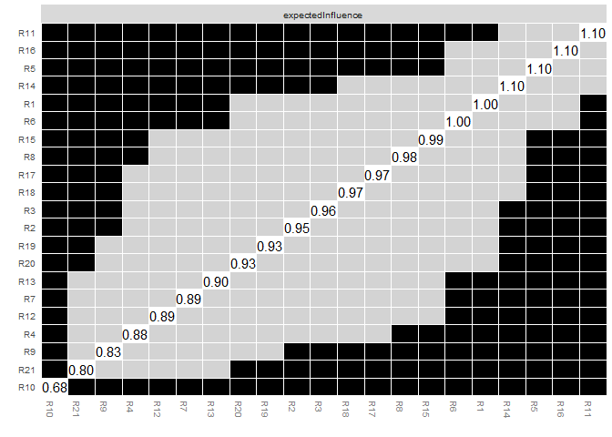<!-- -->

``` r
set.seed(123456)
(Boot_bridge <- bootnet(RESST_Network_eg, 
                        boots = 1000, 
                        statistics = c("bridgeStrength", "bridgeExpectedInfluence"), 
                        communities = groupsint))
```

    ## Note: bootnet will store only the following statistics:  bridgeStrength, bridgeExpectedInfluence

    ## Bootstrapping...

    ##   |                                                                              |                                                                      |   0%  |                                                                              |                                                                      |   1%  |                                                                              |=                                                                     |   1%  |                                                                              |=                                                                     |   2%  |                                                                              |==                                                                    |   2%  |                                                                              |==                                                                    |   3%  |                                                                              |==                                                                    |   4%  |                                                                              |===                                                                   |   4%  |                                                                              |===                                                                   |   5%  |                                                                              |====                                                                  |   5%  |                                                                              |====                                                                  |   6%  |                                                                              |=====                                                                 |   6%  |                                                                              |=====                                                                 |   7%  |                                                                              |=====                                                                 |   8%  |                                                                              |======                                                                |   8%  |                                                                              |======                                                                |   9%  |                                                                              |=======                                                               |   9%  |                                                                              |=======                                                               |  10%  |                                                                              |=======                                                               |  11%  |                                                                              |========                                                              |  11%  |                                                                              |========                                                              |  12%  |                                                                              |=========                                                             |  12%  |                                                                              |=========                                                             |  13%  |                                                                              |=========                                                             |  14%  |                                                                              |==========                                                            |  14%  |                                                                              |==========                                                            |  15%  |                                                                              |===========                                                           |  15%  |                                                                              |===========                                                           |  16%  |                                                                              |============                                                          |  16%  |                                                                              |============                                                          |  17%  |                                                                              |============                                                          |  18%  |                                                                              |=============                                                         |  18%  |                                                                              |=============                                                         |  19%  |                                                                              |==============                                                        |  19%  |                                                                              |==============                                                        |  20%  |                                                                              |==============                                                        |  21%  |                                                                              |===============                                                       |  21%  |                                                                              |===============                                                       |  22%  |                                                                              |================                                                      |  22%  |                                                                              |================                                                      |  23%  |                                                                              |================                                                      |  24%  |                                                                              |=================                                                     |  24%  |                                                                              |=================                                                     |  25%  |                                                                              |==================                                                    |  25%  |                                                                              |==================                                                    |  26%  |                                                                              |===================                                                   |  26%  |                                                                              |===================                                                   |  27%  |                                                                              |===================                                                   |  28%  |                                                                              |====================                                                  |  28%  |                                                                              |====================                                                  |  29%  |                                                                              |=====================                                                 |  29%  |                                                                              |=====================                                                 |  30%  |                                                                              |=====================                                                 |  31%  |                                                                              |======================                                                |  31%  |                                                                              |======================                                                |  32%  |                                                                              |=======================                                               |  32%  |                                                                              |=======================                                               |  33%  |                                                                              |=======================                                               |  34%  |                                                                              |========================                                              |  34%  |                                                                              |========================                                              |  35%  |                                                                              |=========================                                             |  35%  |                                                                              |=========================                                             |  36%  |                                                                              |==========================                                            |  36%  |                                                                              |==========================                                            |  37%  |                                                                              |==========================                                            |  38%  |                                                                              |===========================                                           |  38%  |                                                                              |===========================                                           |  39%  |                                                                              |============================                                          |  39%  |                                                                              |============================                                          |  40%  |                                                                              |============================                                          |  41%  |                                                                              |=============================                                         |  41%  |                                                                              |=============================                                         |  42%  |                                                                              |==============================                                        |  42%  |                                                                              |==============================                                        |  43%  |                                                                              |==============================                                        |  44%  |                                                                              |===============================                                       |  44%  |                                                                              |===============================                                       |  45%  |                                                                              |================================                                      |  45%  |                                                                              |================================                                      |  46%  |                                                                              |=================================                                     |  46%  |                                                                              |=================================                                     |  47%  |                                                                              |=================================                                     |  48%  |                                                                              |==================================                                    |  48%  |                                                                              |==================================                                    |  49%  |                                                                              |===================================                                   |  49%  |                                                                              |===================================                                   |  50%  |                                                                              |===================================                                   |  51%  |                                                                              |====================================                                  |  51%  |                                                                              |====================================                                  |  52%  |                                                                              |=====================================                                 |  52%  |                                                                              |=====================================                                 |  53%  |                                                                              |=====================================                                 |  54%  |                                                                              |======================================                                |  54%  |                                                                              |======================================                                |  55%  |                                                                              |=======================================                               |  55%  |                                                                              |=======================================                               |  56%  |                                                                              |========================================                              |  56%  |                                                                              |========================================                              |  57%  |                                                                              |========================================                              |  58%  |                                                                              |=========================================                             |  58%  |                                                                              |=========================================                             |  59%  |                                                                              |==========================================                            |  59%  |                                                                              |==========================================                            |  60%  |                                                                              |==========================================                            |  61%  |                                                                              |===========================================                           |  61%  |                                                                              |===========================================                           |  62%  |                                                                              |============================================                          |  62%  |                                                                              |============================================                          |  63%  |                                                                              |============================================                          |  64%  |                                                                              |=============================================                         |  64%  |                                                                              |=============================================                         |  65%  |                                                                              |==============================================                        |  65%  |                                                                              |==============================================                        |  66%  |                                                                              |===============================================                       |  66%  |                                                                              |===============================================                       |  67%  |                                                                              |===============================================                       |  68%  |                                                                              |================================================                      |  68%  |                                                                              |================================================                      |  69%  |                                                                              |=================================================                     |  69%  |                                                                              |=================================================                     |  70%  |                                                                              |=================================================                     |  71%  |                                                                              |==================================================                    |  71%  |                                                                              |==================================================                    |  72%  |                                                                              |===================================================                   |  72%  |                                                                              |===================================================                   |  73%  |                                                                              |===================================================                   |  74%  |                                                                              |====================================================                  |  74%  |                                                                              |====================================================                  |  75%  |                                                                              |=====================================================                 |  75%  |                                                                              |=====================================================                 |  76%  |                                                                              |======================================================                |  76%  |                                                                              |======================================================                |  77%  |                                                                              |======================================================                |  78%  |                                                                              |=======================================================               |  78%  |                                                                              |=======================================================               |  79%  |                                                                              |========================================================              |  79%  |                                                                              |========================================================              |  80%  |                                                                              |========================================================              |  81%  |                                                                              |=========================================================             |  81%  |                                                                              |=========================================================             |  82%  |                                                                              |==========================================================            |  82%  |                                                                              |==========================================================            |  83%  |                                                                              |==========================================================            |  84%  |                                                                              |===========================================================           |  84%  |                                                                              |===========================================================           |  85%  |                                                                              |============================================================          |  85%  |                                                                              |============================================================          |  86%  |                                                                              |=============================================================         |  86%  |                                                                              |=============================================================         |  87%  |                                                                              |=============================================================         |  88%  |                                                                              |==============================================================        |  88%  |                                                                              |==============================================================        |  89%  |                                                                              |===============================================================       |  89%  |                                                                              |===============================================================       |  90%  |                                                                              |===============================================================       |  91%  |                                                                              |================================================================      |  91%  |                                                                              |================================================================      |  92%  |                                                                              |=================================================================     |  92%  |                                                                              |=================================================================     |  93%  |                                                                              |=================================================================     |  94%  |                                                                              |==================================================================    |  94%  |                                                                              |==================================================================    |  95%  |                                                                              |===================================================================   |  95%  |                                                                              |===================================================================   |  96%  |                                                                              |====================================================================  |  96%  |                                                                              |====================================================================  |  97%  |                                                                              |====================================================================  |  98%  |                                                                              |===================================================================== |  98%  |                                                                              |===================================================================== |  99%  |                                                                              |======================================================================|  99%  |                                                                              |======================================================================| 100%

    ## Computing statistics...

    ##   |                                                                              |                                                                      |   0%  |                                                                              |                                                                      |   1%  |                                                                              |=                                                                     |   1%  |                                                                              |=                                                                     |   2%  |                                                                              |==                                                                    |   2%  |                                                                              |==                                                                    |   3%  |                                                                              |==                                                                    |   4%  |                                                                              |===                                                                   |   4%  |                                                                              |===                                                                   |   5%  |                                                                              |====                                                                  |   5%  |                                                                              |====                                                                  |   6%  |                                                                              |=====                                                                 |   6%  |                                                                              |=====                                                                 |   7%  |                                                                              |=====                                                                 |   8%  |                                                                              |======                                                                |   8%  |                                                                              |======                                                                |   9%  |                                                                              |=======                                                               |   9%  |                                                                              |=======                                                               |  10%  |                                                                              |=======                                                               |  11%  |                                                                              |========                                                              |  11%  |                                                                              |========                                                              |  12%  |                                                                              |=========                                                             |  12%  |                                                                              |=========                                                             |  13%  |                                                                              |=========                                                             |  14%  |                                                                              |==========                                                            |  14%  |                                                                              |==========                                                            |  15%  |                                                                              |===========                                                           |  15%  |                                                                              |===========                                                           |  16%  |                                                                              |============                                                          |  16%  |                                                                              |============                                                          |  17%  |                                                                              |============                                                          |  18%  |                                                                              |=============                                                         |  18%  |                                                                              |=============                                                         |  19%  |                                                                              |==============                                                        |  19%  |                                                                              |==============                                                        |  20%  |                                                                              |==============                                                        |  21%  |                                                                              |===============                                                       |  21%  |                                                                              |===============                                                       |  22%  |                                                                              |================                                                      |  22%  |                                                                              |================                                                      |  23%  |                                                                              |================                                                      |  24%  |                                                                              |=================                                                     |  24%  |                                                                              |=================                                                     |  25%  |                                                                              |==================                                                    |  25%  |                                                                              |==================                                                    |  26%  |                                                                              |===================                                                   |  26%  |                                                                              |===================                                                   |  27%  |                                                                              |===================                                                   |  28%  |                                                                              |====================                                                  |  28%  |                                                                              |====================                                                  |  29%  |                                                                              |=====================                                                 |  29%  |                                                                              |=====================                                                 |  30%  |                                                                              |=====================                                                 |  31%  |                                                                              |======================                                                |  31%  |                                                                              |======================                                                |  32%  |                                                                              |=======================                                               |  32%  |                                                                              |=======================                                               |  33%  |                                                                              |=======================                                               |  34%  |                                                                              |========================                                              |  34%  |                                                                              |========================                                              |  35%  |                                                                              |=========================                                             |  35%  |                                                                              |=========================                                             |  36%  |                                                                              |==========================                                            |  36%  |                                                                              |==========================                                            |  37%  |                                                                              |==========================                                            |  38%  |                                                                              |===========================                                           |  38%  |                                                                              |===========================                                           |  39%  |                                                                              |============================                                          |  39%  |                                                                              |============================                                          |  40%  |                                                                              |============================                                          |  41%  |                                                                              |=============================                                         |  41%  |                                                                              |=============================                                         |  42%  |                                                                              |==============================                                        |  42%  |                                                                              |==============================                                        |  43%  |                                                                              |==============================                                        |  44%  |                                                                              |===============================                                       |  44%  |                                                                              |===============================                                       |  45%  |                                                                              |================================                                      |  45%  |                                                                              |================================                                      |  46%  |                                                                              |=================================                                     |  46%  |                                                                              |=================================                                     |  47%  |                                                                              |=================================                                     |  48%  |                                                                              |==================================                                    |  48%  |                                                                              |==================================                                    |  49%  |                                                                              |===================================                                   |  49%  |                                                                              |===================================                                   |  50%  |                                                                              |===================================                                   |  51%  |                                                                              |====================================                                  |  51%  |                                                                              |====================================                                  |  52%  |                                                                              |=====================================                                 |  52%  |                                                                              |=====================================                                 |  53%  |                                                                              |=====================================                                 |  54%  |                                                                              |======================================                                |  54%  |                                                                              |======================================                                |  55%  |                                                                              |=======================================                               |  55%  |                                                                              |=======================================                               |  56%  |                                                                              |========================================                              |  56%  |                                                                              |========================================                              |  57%  |                                                                              |========================================                              |  58%  |                                                                              |=========================================                             |  58%  |                                                                              |=========================================                             |  59%  |                                                                              |==========================================                            |  59%  |                                                                              |==========================================                            |  60%  |                                                                              |==========================================                            |  61%  |                                                                              |===========================================                           |  61%  |                                                                              |===========================================                           |  62%  |                                                                              |============================================                          |  62%  |                                                                              |============================================                          |  63%  |                                                                              |============================================                          |  64%  |                                                                              |=============================================                         |  64%  |                                                                              |=============================================                         |  65%  |                                                                              |==============================================                        |  65%  |                                                                              |==============================================                        |  66%  |                                                                              |===============================================                       |  66%  |                                                                              |===============================================                       |  67%  |                                                                              |===============================================                       |  68%  |                                                                              |================================================                      |  68%  |                                                                              |================================================                      |  69%  |                                                                              |=================================================                     |  69%  |                                                                              |=================================================                     |  70%  |                                                                              |=================================================                     |  71%  |                                                                              |==================================================                    |  71%  |                                                                              |==================================================                    |  72%  |                                                                              |===================================================                   |  72%  |                                                                              |===================================================                   |  73%  |                                                                              |===================================================                   |  74%  |                                                                              |====================================================                  |  74%  |                                                                              |====================================================                  |  75%  |                                                                              |=====================================================                 |  75%  |                                                                              |=====================================================                 |  76%  |                                                                              |======================================================                |  76%  |                                                                              |======================================================                |  77%  |                                                                              |======================================================                |  78%  |                                                                              |=======================================================               |  78%  |                                                                              |=======================================================               |  79%  |                                                                              |========================================================              |  79%  |                                                                              |========================================================              |  80%  |                                                                              |========================================================              |  81%  |                                                                              |=========================================================             |  81%  |                                                                              |=========================================================             |  82%  |                                                                              |==========================================================            |  82%  |                                                                              |==========================================================            |  83%  |                                                                              |==========================================================            |  84%  |                                                                              |===========================================================           |  84%  |                                                                              |===========================================================           |  85%  |                                                                              |============================================================          |  85%  |                                                                              |============================================================          |  86%  |                                                                              |=============================================================         |  86%  |                                                                              |=============================================================         |  87%  |                                                                              |=============================================================         |  88%  |                                                                              |==============================================================        |  88%  |                                                                              |==============================================================        |  89%  |                                                                              |===============================================================       |  89%  |                                                                              |===============================================================       |  90%  |                                                                              |===============================================================       |  91%  |                                                                              |================================================================      |  91%  |                                                                              |================================================================      |  92%  |                                                                              |=================================================================     |  92%  |                                                                              |=================================================================     |  93%  |                                                                              |=================================================================     |  94%  |                                                                              |==================================================================    |  94%  |                                                                              |==================================================================    |  95%  |                                                                              |===================================================================   |  95%  |                                                                              |===================================================================   |  96%  |                                                                              |====================================================================  |  96%  |                                                                              |====================================================================  |  97%  |                                                                              |====================================================================  |  98%  |                                                                              |===================================================================== |  98%  |                                                                              |===================================================================== |  99%  |                                                                              |======================================================================|  99%  |                                                                              |======================================================================| 100%

    ## === bootnet Results ===
    ## Number of nodes: 21 
    ## Number of non-zero edges in sample: 115 / 210 
    ## Mean weight of sample: 0.04766758 
    ## Number of bootstrapped networks: 1000 
    ## Results of original sample stored in value$sample 
    ## Table of all statistics from original sample stored in value$sampleTable 
    ## Results of bootstraps stored in value$boots 
    ## Table of all statistics from bootstraps stored in value$bootTable 
    ##  
    ## Use plot(value$sample) to plot estimated network of original sample 
    ## Use summary(value) to inspect summarized statistics (see ?summary.bootnet for details) 
    ## Use plot(value) to plot summarized statistics (see ?plot.bootnet for details) 
    ## 
    ## Relevant references:
    ## 
    ##      Friedman, J. H., Hastie, T., & Tibshirani, R. (2008). Sparse inverse covariance estimation with the graphical lasso. Biostatistics, 9 (3), 432-441.
    ##  Foygel, R., & Drton, M. (2010). Extended Bayesian information criteria for Gaussian graphical models. 
    ##  Friedman, J. H., Hastie, T., & Tibshirani, R. (2014). glasso: Graphical lasso estimation of gaussian graphical models. Retrieved from https://CRAN.R-project.org/package=glasso
    ##  Epskamp, S., Cramer, A., Waldorp, L., Schmittmann, V. D., & Borsboom, D. (2012). qgraph: Network visualizations of relationships in psychometric data. Journal of Statistical Software, 48 (1), 1-18.
    ##  Epskamp, S., Borsboom, D., & Fried, E. I. (2016). Estimating psychological networks and their accuracy: a tutorial paper. arXiv preprint, arXiv:1604.08462.

``` r
table(Boot_bridge$bootTable$type)
```

    ## 
    ## bridgeExpectedInfluence          bridgeStrength 
    ##                   21000                   21000

``` r
plot(Boot_bridge, statistics = "bridgeExpectedInfluence", plot = "difference")
```

    ## Expected significance level given number of bootstrap samples is approximately: 0.05

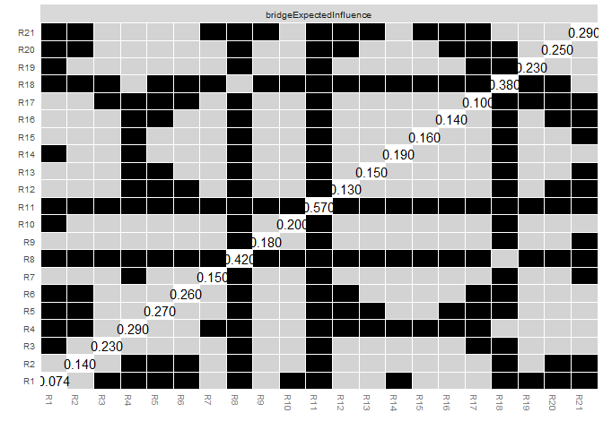<!-- -->

``` r
plot(Boot_bridge, statistics = "bridgeStrength", plot = "difference")
```

    ## Expected significance level given number of bootstrap samples is approximately: 0.05

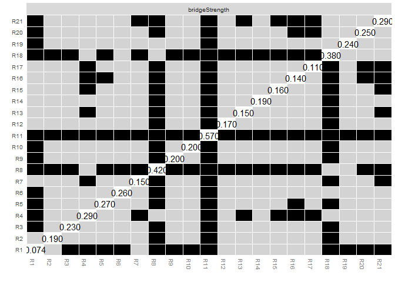<!-- -->

``` r
# figures
pdf("Output/EBIC_network.pdf", width = 10, height = 10)
plot(RESST_Network_eg, 
     layout = "spring", 
     labels = TRUE)
dev.off() 
```

    ## png 
    ##   2

``` r
pdf("Output/EBIC_network_clusters.pdf", width = 10, height = 10)
network_RESST_comm 
```

    ## From     To  Weight
    ## 1     ---     2   0.25 
    ## 1     ---     3   0.08 
    ## 2     ---     3   0.16 
    ## 1     ---     4   0.12 
    ## 2     ---     4   0.08 
    ## 3     ---     4   0.17 
    ## 1     ---     5   0.19 
    ## 2     ---     5   0.13 
    ## 3     ---     5   0.04 
    ## 4     ---     5   0.07 
    ## 1     ---     6   0.18 
    ## 3     ---     6   0.17 
    ## 4     ---     6   0.05 
    ## 5     ---     6   0.29 
    ## 1     ---     7   0.15 
    ## 2     ---     7   0.18 
    ## 3     ---     7   0.12 
    ## 4     ---     7   0.1 
    ## 5     ---     7   0.11 
    ## 6     ---     7   0.08 
    ## 1     ---     8   0 
    ## 3     ---     8   0.05 
    ## 5     ---     8   0.01 
    ## 6     ---     8   0.12 
    ## 7     ---     8   0.01 
    ## 8     ---     9   0.36 
    ## 8     ---     10      0.03 
    ## 9     ---     10      0.17 
    ## 1     ---     11      0.02 
    ## 3     ---     11      0.1 
    ## 5     ---     11      0.14 
    ## 6     ---     11      0.07 
    ## 7     ---     11      0.01 
    ## 8     ---     11      0.17 
    ## 9     ---     11      0.12 
    ## 10    ---     11      0.28 
    ## 2     ---     12      -0.02 
    ## 6     ---     12      0.03 
    ## 9     ---     12      0.06 
    ## 11    ---     12      0.04 
    ## 4     ---     13      0.09 
    ## 7     ---     13      0.01 
    ## 9     ---     13      0.03 
    ## 11    ---     13      0.01 
    ## 12    ---     13      0.09 
    ## 1     ---     14      0.01 
    ## 5     ---     14      0.04 
    ## 8     ---     14      0.06 
    ## 9     ---     14      0.04 
    ## 11    ---     14      0.02 
    ## 12    ---     14      0.15 
    ## 13    ---     14      0.25 
    ## 7     ---     15      0.01 
    ## 8     ---     15      0.01 
    ## 9     ---     15      0.04 
    ## 10    ---     15      0.07 
    ## 12    ---     15      0.14 
    ## 13    ---     15      0.11 
    ## 14    ---     15      0.15 
    ## 1     ---     16      0.04 
    ## 5     ---     16      0.01 
    ## 9     ---     16      0 
    ## 11    ---     16      0.06 
    ## 12    ---     16      0.27 
    ## 13    ---     16      0.09 
    ## 14    ---     16      0.22 
    ## 15    ---     16      0.19 
    ## 2     ---     17      0 
    ## 8     ---     17      0 
    ## 9     ---     17      0.02 
    ## 10    ---     17      0 
    ## 11    ---     17      0.06 
    ## 12    ---     17      0.12 
    ## 13    ---     17      0.21 
    ## 14    ---     17      0.11 
    ## 15    ---     17      0.23 
    ## 16    ---     17      0.2 
    ## 2     ---     18      0.03 
    ## 3     ---     18      0.06 
    ## 4     ---     18      0.04 
    ## 5     ---     18      0.03 
    ## 8     ---     18      0.08 
    ## 10    ---     18      0.07 
    ## 11    ---     18      0.01 
    ## 14    ---     18      0.02 
    ## 15    ---     18      0.01 
    ## 16    ---     18      0.02 
    ## 2     ---     19      0.04 
    ## 3     ---     19      0.02 
    ## 4     ---     19      0.05 
    ## 7     ---     19      0.05 
    ## 8     ---     19      0.02 
    ## 9     ---     19      -0.01 
    ## 10    ---     19      0.04 
    ## 13    ---     19      0.01 
    ## 17    ---     19      0.01 
    ## 18    ---     19      0.24 
    ## 2     ---     20      0.09 
    ## 4     ---     20      0.11 
    ## 8     ---     20      0.02 
    ## 10    ---     20      0.02 
    ## 18    ---     20      0.16 
    ## 19    ---     20      0.32 
    ## 5     ---     21      0.04 
    ## 6     ---     21      0.04 
    ## 7     ---     21      0.06 
    ## 8     ---     21      0.03 
    ## 11    ---     21      0.03 
    ## 12    ---     21      0.02 
    ## 15    ---     21      0.03 
    ## 16    ---     21      0.02 
    ## 17    ---     21      0.02 
    ## 18    ---     21      0.18 
    ## 19    ---     21      0.15 
    ## 20    ---     21      0.19

``` r
dev.off() 
```

    ## png 
    ##   2

``` r
pdf("Output/EBIC_centrality_node_raw.pdf", width = 10, height = 10)
centralityPlot(RESST_Network_eg, include = "all", scale = "raw", orderBy = "ExpectedInfluence")
dev.off() 
```

    ## png 
    ##   2

``` r
pdf("Output/EBIC_centrality_node_zscores.pdf", width = 10, height = 10)
centralityPlot(RESST_Network_eg, include = "all", scale = "z-score", orderBy = "ExpectedInfluence")
```

    ## Note: z-scores are shown on x-axis rather than raw centrality indices.

``` r
dev.off() 
```

    ## png 
    ##   2

``` r
pdf("Output/EBIC_centrality_bridge.pdf", width = 13, height = 7)
plot(intbridge, zscore = TRUE, color = TRUE)
```

    ## Warning: Vectorized input to `element_text()` is not officially supported.
    ## ℹ Results may be unexpected or may change in future versions of ggplot2.

``` r
dev.off() 
```

    ## png 
    ##   2

``` r
pdf("Output/EBIC_CS-coefficients.pdf", width = 5, height = 5)
plot(All_boot_case, 'all')
dev.off()
```

    ## png 
    ##   2

``` r
pdf("Output/EBIC_CS-coefficient_EI.pdf", width = 5, height = 5)
plot(All_boot_case, 'expectedInfluence')
dev.off()
```

    ## png 
    ##   2

``` r
pdf("Output/EBIC_CS-coefficient_str.pdf", width = 5, height = 5)
plot(All_boot_case, 'strength')
dev.off()
```

    ## png 
    ##   2

``` r
pdf("Output/EBIC_CS-coefficient_bridge_EI.pdf", width = 5, height = 5)
plot(All_boot_case, 'bridgeExpectedInfluence')
dev.off()
```

    ## png 
    ##   2

``` r
pdf("Output/EBIC_CS-coefficient_bridge_str.pdf", width = 5, height = 5)
plot(All_boot_case, 'BridgeStrength')
dev.off()
```

    ## png 
    ##   2

``` r
pdf("Output/EBIC_boot_edges_1.pdf", width = 10, height = 10)
plot(All_boot, labels = FALSE, order = "sample")
dev.off()
```

    ## png 
    ##   2

``` r
pdf("Output/EBIC_boot_edges_2.pdf", width = 10, height = 15)
plot(All_boot, plot = "interval", split0 = TRUE, order = "sample", labels = FALSE)
dev.off()
```

    ## png 
    ##   2

``` r
pdf("Output/Centrality_diff_str.pdf")
plot(All_boot, "strength", order="sample") 
```

    ## Expected significance level given number of bootstrap samples is approximately: 0.05

``` r
dev.off()
```

    ## png 
    ##   2

``` r
pdf("Output/Centrality_diff_EI.pdf")
plot(All_boot, "ExpectedInfluence", order="sample") 
```

    ## Expected significance level given number of bootstrap samples is approximately: 0.05

``` r
dev.off()
```

    ## png 
    ##   2

``` r
pdf("Output/Centrality_diff_BEI.pdf")
plot(Boot_bridge, statistics = "bridgeExpectedInfluence", plot = "difference")
```

    ## Expected significance level given number of bootstrap samples is approximately: 0.05

``` r
dev.off()
```

    ## png 
    ##   2

``` r
pdf("Output/Centrality_diff_BStr.pdf")
plot(Boot_bridge, statistics = "bridgeStrength", plot = "difference")
```

    ## Expected significance level given number of bootstrap samples is approximately: 0.05

``` r
dev.off()
```

    ## png 
    ##   2

``` r
pdf("Output/EBIC_edge_difference.pdf", width = 10, height = 12)
edge_diff_plot
dev.off()
```

    ## png 
    ##   2

# EBIC SA invariance

``` r
load_libraries <- function(){
  if (!require("bootnet"))
    install.packages("bootnet"); library(bootnet)
  if (!require("dplyr"))
    install.packages("dplyr"); library(dplyr)
  if (!require("magrittr"))
    install.packages("magrittr"); library(magrittr)
  if (!require("psych"))
    install.packages("psych"); library(psych)
  if (!require("qgraph"))
    install.packages("qgraph"); library(qgraph)
}

load_libraries()
```

    ## Loading required package: magrittr

    ## 
    ## Attaching package: 'magrittr'

    ## The following object is masked from 'package:purrr':
    ## 
    ##     set_names

    ## The following object is masked from 'package:tidyr':
    ## 
    ##     extract

``` r
compareCentrality <- function(net1, net2,
                              include = c("Strength",
                                          "Closeness",
                                          "Betweenness",
                                          "ExpectedInfluence",
                                          "all",
                                          "All"),
                              orderBy = c("Strength",
                                          "Closeness",
                                          "Betweenness",
                                          "ExpectedInfluence"),
                              decreasing = T,
                              legendName = '',
                              net1Name = 'Network 1',
                              net2Name = 'Network 2'){
  
  library(ggplot2)
  library(forcats)
  
  if(include == "All" | include == "all"){
    include = c("Strength",
                "Closeness",
                "Betweenness",
                "ExpectedInfluence")
  }
  
  df <- centralityTable(net1, net2) %>% filter(measure %in% include)
  
  df %>% 
    mutate(graph = case_when(graph == 'graph 1' ~ net1Name,
                             graph == 'graph 2' ~ net2Name),
           graph = as.factor(graph),
           node = as.factor(node)) %>% 
    
    mutate(node = fct_reorder(node, value)) %>% 
    
    ggplot(aes(x = node, y = value, group = graph)) +
    
    geom_line(aes(linetype = graph), linewidth = 1) +
    
    labs(x = '', y = '') +
    
    scale_linetype_discrete(name = legendName) +
    
    coord_flip() +
    
    facet_grid(~measure) +
    
    theme_bw()
  
}
```

``` r
set.seed(123456)
NCT <- NCT(data1 = RESST_inv[RESST_inv$SA_group == "0", 1:21],
    data2 = RESST_inv[RESST_inv$SA_group == "1", 1:21], 
    it = 1000, 
    binary.data = FALSE, 
    paired = FALSE, 
    weighted = TRUE, 
    abs = TRUE, 
    test.edges = TRUE,
    edges ="all", 
    progressbar = TRUE, 
    make.positive.definite = FALSE,
    p.adjust.methods = "none", 
    test.centrality = TRUE, 
    centrality=c("strength", "expectedInfluence", "bridgeStrength", "bridgeExpectedInfluence"), 
    nodes = "all", 
    communities = c('1','1','1','1','1','1','1',
                    '2','2','2','2',
                    '3','3','3','3', '3', '3', 
                    '4', '4', '4', '4'), 
    useCommunities = "all",
    estimatorArgs=list(), 
    verbose=TRUE)
```

    ##   |                                                                              |                                                                      |   0%  |                                                                              |                                                                      |   1%  |                                                                              |=                                                                     |   1%  |                                                                              |=                                                                     |   2%  |                                                                              |==                                                                    |   2%  |                                                                              |==                                                                    |   3%  |                                                                              |==                                                                    |   4%  |                                                                              |===                                                                   |   4%  |                                                                              |===                                                                   |   5%  |                                                                              |====                                                                  |   5%  |                                                                              |====                                                                  |   6%  |                                                                              |=====                                                                 |   6%  |                                                                              |=====                                                                 |   7%  |                                                                              |=====                                                                 |   8%  |                                                                              |======                                                                |   8%  |                                                                              |======                                                                |   9%  |                                                                              |=======                                                               |   9%  |                                                                              |=======                                                               |  10%  |                                                                              |=======                                                               |  11%  |                                                                              |========                                                              |  11%  |                                                                              |========                                                              |  12%  |                                                                              |=========                                                             |  12%  |                                                                              |=========                                                             |  13%  |                                                                              |=========                                                             |  14%  |                                                                              |==========                                                            |  14%  |                                                                              |==========                                                            |  15%  |                                                                              |===========                                                           |  15%  |                                                                              |===========                                                           |  16%  |                                                                              |============                                                          |  16%  |                                                                              |============                                                          |  17%  |                                                                              |============                                                          |  18%  |                                                                              |=============                                                         |  18%  |                                                                              |=============                                                         |  19%  |                                                                              |==============                                                        |  19%  |                                                                              |==============                                                        |  20%  |                                                                              |==============                                                        |  21%  |                                                                              |===============                                                       |  21%  |                                                                              |===============                                                       |  22%  |                                                                              |================                                                      |  22%  |                                                                              |================                                                      |  23%  |                                                                              |================                                                      |  24%  |                                                                              |=================                                                     |  24%  |                                                                              |=================                                                     |  25%  |                                                                              |==================                                                    |  25%  |                                                                              |==================                                                    |  26%  |                                                                              |===================                                                   |  26%  |                                                                              |===================                                                   |  27%  |                                                                              |===================                                                   |  28%  |                                                                              |====================                                                  |  28%  |                                                                              |====================                                                  |  29%  |                                                                              |=====================                                                 |  29%  |                                                                              |=====================                                                 |  30%  |                                                                              |=====================                                                 |  31%  |                                                                              |======================                                                |  31%  |                                                                              |======================                                                |  32%  |                                                                              |=======================                                               |  32%  |                                                                              |=======================                                               |  33%  |                                                                              |=======================                                               |  34%  |                                                                              |========================                                              |  34%  |                                                                              |========================                                              |  35%  |                                                                              |=========================                                             |  35%  |                                                                              |=========================                                             |  36%  |                                                                              |==========================                                            |  36%  |                                                                              |==========================                                            |  37%  |                                                                              |==========================                                            |  38%  |                                                                              |===========================                                           |  38%  |                                                                              |===========================                                           |  39%  |                                                                              |============================                                          |  39%  |                                                                              |============================                                          |  40%  |                                                                              |============================                                          |  41%  |                                                                              |=============================                                         |  41%  |                                                                              |=============================                                         |  42%  |                                                                              |==============================                                        |  42%  |                                                                              |==============================                                        |  43%  |                                                                              |==============================                                        |  44%  |                                                                              |===============================                                       |  44%  |                                                                              |===============================                                       |  45%  |                                                                              |================================                                      |  45%  |                                                                              |================================                                      |  46%  |                                                                              |=================================                                     |  46%  |                                                                              |=================================                                     |  47%  |                                                                              |=================================                                     |  48%  |                                                                              |==================================                                    |  48%  |                                                                              |==================================                                    |  49%  |                                                                              |===================================                                   |  49%  |                                                                              |===================================                                   |  50%  |                                                                              |===================================                                   |  51%  |                                                                              |====================================                                  |  51%  |                                                                              |====================================                                  |  52%  |                                                                              |=====================================                                 |  52%  |                                                                              |=====================================                                 |  53%  |                                                                              |=====================================                                 |  54%  |                                                                              |======================================                                |  54%  |                                                                              |======================================                                |  55%  |                                                                              |=======================================                               |  55%  |                                                                              |=======================================                               |  56%  |                                                                              |========================================                              |  56%  |                                                                              |========================================                              |  57%  |                                                                              |========================================                              |  58%  |                                                                              |=========================================                             |  58%  |                                                                              |=========================================                             |  59%  |                                                                              |==========================================                            |  59%  |                                                                              |==========================================                            |  60%  |                                                                              |==========================================                            |  61%  |                                                                              |===========================================                           |  61%  |                                                                              |===========================================                           |  62%  |                                                                              |============================================                          |  62%  |                                                                              |============================================                          |  63%  |                                                                              |============================================                          |  64%  |                                                                              |=============================================                         |  64%  |                                                                              |=============================================                         |  65%  |                                                                              |==============================================                        |  65%  |                                                                              |==============================================                        |  66%  |                                                                              |===============================================                       |  66%  |                                                                              |===============================================                       |  67%  |                                                                              |===============================================                       |  68%  |                                                                              |================================================                      |  68%  |                                                                              |================================================                      |  69%  |                                                                              |=================================================                     |  69%  |                                                                              |=================================================                     |  70%  |                                                                              |=================================================                     |  71%  |                                                                              |==================================================                    |  71%  |                                                                              |==================================================                    |  72%  |                                                                              |===================================================                   |  72%  |                                                                              |===================================================                   |  73%  |                                                                              |===================================================                   |  74%  |                                                                              |====================================================                  |  74%  |                                                                              |====================================================                  |  75%  |                                                                              |=====================================================                 |  75%  |                                                                              |=====================================================                 |  76%  |                                                                              |======================================================                |  76%  |                                                                              |======================================================                |  77%  |                                                                              |======================================================                |  78%  |                                                                              |=======================================================               |  78%  |                                                                              |=======================================================               |  79%  |                                                                              |========================================================              |  79%  |                                                                              |========================================================              |  80%  |                                                                              |========================================================              |  81%  |                                                                              |=========================================================             |  81%  |                                                                              |=========================================================             |  82%  |                                                                              |==========================================================            |  82%  |                                                                              |==========================================================            |  83%  |                                                                              |==========================================================            |  84%  |                                                                              |===========================================================           |  84%  |                                                                              |===========================================================           |  85%  |                                                                              |============================================================          |  85%  |                                                                              |============================================================          |  86%  |                                                                              |=============================================================         |  86%  |                                                                              |=============================================================         |  87%  |                                                                              |=============================================================         |  88%  |                                                                              |==============================================================        |  88%  |                                                                              |==============================================================        |  89%  |                                                                              |===============================================================       |  89%  |                                                                              |===============================================================       |  90%  |                                                                              |===============================================================       |  91%  |                                                                              |================================================================      |  91%  |                                                                              |================================================================      |  92%  |                                                                              |=================================================================     |  92%  |                                                                              |=================================================================     |  93%  |                                                                              |=================================================================     |  94%  |                                                                              |==================================================================    |  94%  |                                                                              |==================================================================    |  95%  |                                                                              |===================================================================   |  95%  |                                                                              |===================================================================   |  96%  |                                                                              |====================================================================  |  96%  |                                                                              |====================================================================  |  97%  |                                                                              |====================================================================  |  98%  |                                                                              |===================================================================== |  98%  |                                                                              |===================================================================== |  99%  |                                                                              |======================================================================|  99%  |                                                                              |======================================================================| 100%

``` r
summary(NCT)
```

    ##  INDEPENDENT GROUPS GAUSSIAN NETWORK COMPARISON TEST 
    ## 
    ##  P-VALUE CORRECTION: none 
    ## 
    ##  NETWORK INVARIANCE TEST 
    ##  Test statistic M: 0.1616685 
    ##  p-value 0.6883117 
    ## 
    ##  GLOBAL STRENGTH INVARIANCE TEST 
    ##  Global strength per group:  10.06331 10.13463 
    ##  Test statistic S:  0.07131984 
    ##  p-value 0.6503497
    ## 
    ##  EDGE INVARIANCE TEST 
    ##     Var1 Var2     p-value Test statistic E
    ## 22    R1   R2 0.773226773       0.02046502
    ## 43    R1   R3 0.933066933       0.00526788
    ## 44    R2   R3 0.413586414       0.05449085
    ## 64    R1   R4 0.616383616       0.03263711
    ## 65    R2   R4 0.565434565       0.04444846
    ## 66    R3   R4 0.286713287       0.07600041
    ## 85    R1   R5 0.692307692       0.02557056
    ## 86    R2   R5 0.018981019       0.16166852
    ## 87    R3   R5 0.058941059       0.11586259
    ## 88    R4   R5 0.192807193       0.08664519
    ## 106   R1   R6 0.056943057       0.12837531
    ## 107   R2   R6 0.046953047       0.03821620
    ## 108   R3   R6 0.957042957       0.00314156
    ## 109   R4   R6 0.895104895       0.00882269
    ## 110   R5   R6 0.868131868       0.01104429
    ## 127   R1   R7 0.399600400       0.05876801
    ## 128   R2   R7 0.165834166       0.09646965
    ## 129   R3   R7 0.827172827       0.01794399
    ## 130   R4   R7 0.150849151       0.10079208
    ## 131   R5   R7 0.877122877       0.01044472
    ## 132   R6   R7 0.963036963       0.00361065
    ## 148   R1   R8 0.062937063       0.05200257
    ## 149   R2   R8 0.305694306       0.01498738
    ## 150   R3   R8 0.302697303       0.06059838
    ## 151   R4   R8 0.308691309       0.00000329
    ## 152   R5   R8 0.747252747       0.01521692
    ## 153   R6   R8 0.127872128       0.10384891
    ## 154   R7   R8 0.793206793       0.00763702
    ## 169   R1   R9 1.000000000       0.00000000
    ## 170   R2   R9 1.000000000       0.00000000
    ## 171   R3   R9 1.000000000       0.00000000
    ## 172   R4   R9 1.000000000       0.00000000
    ## 173   R5   R9 1.000000000       0.00000000
    ## 174   R6   R9 1.000000000       0.00000000
    ## 175   R7   R9 1.000000000       0.00000000
    ## 176   R8   R9 0.786213786       0.01998196
    ## 190   R1  R10 0.291708292       0.00542267
    ## 191   R2  R10 0.211788212       0.01011274
    ## 192   R3  R10 1.000000000       0.00000000
    ## 193   R4  R10 0.015984016       0.04393955
    ## 194   R5  R10 1.000000000       0.00000000
    ## 195   R6  R10 0.064935065       0.01645894
    ## 196   R7  R10 1.000000000       0.00000000
    ## 197   R8  R10 0.615384615       0.03431392
    ## 198   R9  R10 0.783216783       0.01936868
    ## 211   R1  R11 0.626373626       0.02935496
    ## 212   R2  R11 1.000000000       0.00000000
    ## 213   R3  R11 0.785214785       0.01766860
    ## 214   R4  R11 1.000000000       0.00000000
    ## 215   R5  R11 0.109890110       0.09927255
    ## 216   R6  R11 0.087912088       0.11400225
    ## 217   R7  R11 0.074925075       0.06194787
    ## 218   R8  R11 0.570429570       0.04462689
    ## 219   R9  R11 0.826173826       0.01630696
    ## 220  R10  R11 0.883116883       0.01016284
    ## 232   R1  R12 1.000000000       0.00000000
    ## 233   R2  R12 1.000000000       0.00000000
    ## 234   R3  R12 0.152847153       0.02425619
    ## 235   R4  R12 1.000000000       0.00000000
    ## 236   R5  R12 0.627372627       0.00197459
    ## 237   R6  R12 0.836163836       0.01095204
    ## 238   R7  R12 1.000000000       0.00000000
    ## 239   R8  R12 1.000000000       0.00000000
    ## 240   R9  R12 0.092907093       0.09346389
    ## 241  R10  R12 1.000000000       0.00000000
    ## 242  R11  R12 0.053946054       0.09272344
    ## 253   R1  R13 1.000000000       0.00000000
    ## 254   R2  R13 0.028971029       0.02430980
    ## 255   R3  R13 0.073926074       0.00231697
    ## 256   R4  R13 0.140859141       0.07976927
    ## 257   R5  R13 1.000000000       0.00000000
    ## 258   R6  R13 1.000000000       0.00000000
    ## 259   R7  R13 0.344655345       0.02016362
    ## 260   R8  R13 1.000000000       0.00000000
    ## 261   R9  R13 0.102897103       0.07491119
    ## 262  R10  R13 1.000000000       0.00000000
    ## 263  R11  R13 0.952047952       0.00198455
    ## 264  R12  R13 0.193806194       0.09852972
    ## 274   R1  R14 0.072927073       0.05866075
    ## 275   R2  R14 0.012987013       0.04555740
    ## 276   R3  R14 1.000000000       0.00000000
    ## 277   R4  R14 0.461538462       0.00289692
    ## 278   R5  R14 0.728271728       0.01924509
    ## 279   R6  R14 0.241758242       0.01533529
    ## 280   R7  R14 0.457542458       0.00027847
    ## 281   R8  R14 0.092907093       0.08789019
    ## 282   R9  R14 0.203796204       0.06754411
    ## 283  R10  R14 1.000000000       0.00000000
    ## 284  R11  R14 0.130869131       0.06850840
    ## 285  R12  R14 0.037962038       0.14541916
    ## 286  R13  R14 0.785214785       0.02064368
    ## 295   R1  R15 1.000000000       0.00000000
    ## 296   R2  R15 1.000000000       0.00000000
    ## 297   R3  R15 1.000000000       0.00000000
    ## 298   R4  R15 0.054945055       0.01047455
    ## 299   R5  R15 1.000000000       0.00000000
    ## 300   R6  R15 0.220779221       0.01693261
    ## 301   R7  R15 0.534465534       0.00969239
    ## 302   R8  R15 0.694305694       0.01251290
    ## 303   R9  R15 0.924075924       0.00538604
    ## 304  R10  R15 0.433566434       0.04406969
    ## 305  R11  R15 0.064935065       0.06234838
    ## 306  R12  R15 0.278721279       0.08761555
    ## 307  R13  R15 0.843156843       0.01284204
    ## 308  R14  R15 0.616383616       0.03616418
    ## 316   R1  R16 0.678321678       0.01972293
    ## 317   R2  R16 1.000000000       0.00000000
    ## 318   R3  R16 0.208791209       0.00296639
    ## 319   R4  R16 1.000000000       0.00000000
    ## 320   R5  R16 0.416583417       0.02318885
    ## 321   R6  R16 1.000000000       0.00000000
    ## 322   R7  R16 1.000000000       0.00000000
    ## 323   R8  R16 1.000000000       0.00000000
    ## 324   R9  R16 0.104895105       0.05177849
    ## 325  R10  R16 1.000000000       0.00000000
    ## 326  R11  R16 0.203796204       0.07556794
    ## 327  R12  R16 0.726273726       0.02454553
    ## 328  R13  R16 0.842157842       0.01680121
    ## 329  R14  R16 0.738261738       0.02589049
    ## 330  R15  R16 0.379620380       0.06290079
    ## 337   R1  R17 1.000000000       0.00000000
    ## 338   R2  R17 0.559440559       0.00762859
    ## 339   R3  R17 0.296703297       0.00068124
    ## 340   R4  R17 1.000000000       0.00000000
    ## 341   R5  R17 1.000000000       0.00000000
    ## 342   R6  R17 0.068931069       0.01644898
    ## 343   R7  R17 0.513486513       0.00017496
    ## 344   R8  R17 0.025974026       0.06843127
    ## 345   R9  R17 0.901098901       0.00882991
    ## 346  R10  R17 0.699300699       0.01196173
    ## 347  R11  R17 0.440559441       0.04671153
    ## 348  R12  R17 0.079920080       0.12977224
    ## 349  R13  R17 0.855144855       0.01386870
    ## 350  R14  R17 0.198801199       0.09675673
    ## 351  R15  R17 0.047952048       0.14666700
    ## 352  R16  R17 0.552447552       0.04127595
    ## 358   R1  R18 0.002997003       0.09561748
    ## 359   R2  R18 0.133866134       0.07929696
    ## 360   R3  R18 0.710289710       0.02489194
    ## 361   R4  R18 0.533466533       0.04291811
    ## 362   R5  R18 0.143856144       0.06427628
    ## 363   R6  R18 1.000000000       0.00000000
    ## 364   R7  R18 0.642357642       0.00521614
    ## 365   R8  R18 0.934065934       0.00506180
    ## 366   R9  R18 1.000000000       0.00000000
    ## 367  R10  R18 0.081918082       0.10204300
    ## 368  R11  R18 0.783216783       0.01533527
    ## 369  R12  R18 0.126873127       0.02950378
    ## 370  R13  R18 1.000000000       0.00000000
    ## 371  R14  R18 0.139860140       0.04896447
    ## 372  R15  R18 0.464535465       0.01881573
    ## 373  R16  R18 0.341658342       0.02939743
    ## 374  R17  R18 1.000000000       0.00000000
    ## 379   R1  R19 1.000000000       0.00000000
    ## 380   R2  R19 0.153846154       0.07769054
    ## 381   R3  R19 0.253746254       0.04856693
    ## 382   R4  R19 0.317682318       0.06241713
    ## 383   R5  R19 1.000000000       0.00000000
    ## 384   R6  R19 1.000000000       0.00000000
    ## 385   R7  R19 0.226773227       0.07324646
    ## 386   R8  R19 0.442557443       0.03371881
    ## 387   R9  R19 1.000000000       0.00000000
    ## 388  R10  R19 0.646353646       0.02726678
    ## 389  R11  R19 1.000000000       0.00000000
    ## 390  R12  R19 1.000000000       0.00000000
    ## 391  R13  R19 0.235764236       0.03219703
    ## 392  R14  R19 1.000000000       0.00000000
    ## 393  R15  R19 1.000000000       0.00000000
    ## 394  R16  R19 1.000000000       0.00000000
    ## 395  R17  R19 0.414585415       0.02138491
    ## 396  R18  R19 0.882117882       0.01115559
    ## 400   R1  R20 0.284715285       0.00662710
    ## 401   R2  R20 0.692307692       0.02760445
    ## 402   R3  R20 0.264735265       0.01467909
    ## 403   R4  R20 0.021978022       0.15456948
    ## 404   R5  R20 1.000000000       0.00000000
    ## 405   R6  R20 1.000000000       0.00000000
    ## 406   R7  R20 0.180819181       0.02509128
    ## 407   R8  R20 0.201798202       0.05386604
    ## 408   R9  R20 1.000000000       0.00000000
    ## 409  R10  R20 0.589410589       0.02949899
    ## 410  R11  R20 1.000000000       0.00000000
    ## 411  R12  R20 1.000000000       0.00000000
    ## 412  R13  R20 1.000000000       0.00000000
    ## 413  R14  R20 1.000000000       0.00000000
    ## 414  R15  R20 1.000000000       0.00000000
    ## 415  R16  R20 1.000000000       0.00000000
    ## 416  R17  R20 1.000000000       0.00000000
    ## 417  R18  R20 0.159840160       0.11228925
    ## 418  R19  R20 0.316683317       0.07817860
    ## 421   R1  R21 1.000000000       0.00000000
    ## 422   R2  R21 0.098901099       0.02724813
    ## 423   R3  R21 1.000000000       0.00000000
    ## 424   R4  R21 0.147852148       0.02852212
    ## 425   R5  R21 0.584415584       0.03410688
    ## 426   R6  R21 0.582417582       0.03362566
    ## 427   R7  R21 0.218781219       0.07320858
    ## 428   R8  R21 0.381618382       0.04936665
    ## 429   R9  R21 1.000000000       0.00000000
    ## 430  R10  R21 0.078921079       0.04416413
    ## 431  R11  R21 0.653346653       0.02784482
    ## 432  R12  R21 0.254745255       0.04518278
    ## 433  R13  R21 1.000000000       0.00000000
    ## 434  R14  R21 0.139860140       0.01982158
    ## 435  R15  R21 0.929070929       0.00565531
    ## 436  R16  R21 0.251748252       0.04556647
    ## 437  R17  R21 0.530469530       0.02730149
    ## 438  R18  R21 0.932067932       0.00677049
    ## 439  R19  R21 0.433566434       0.06535509
    ## 440  R20  R21 0.299700300       0.08096745
    ## 
    ## 
    ##  CENTRALITY INVARIANCE TEST 
    ##  Nodes tested: R1 R2 R3 R4 R5 R6 R7 R8 R9 R10 R11 R12 R13 R14 R15 R16 R17 R18 R19 R20 R21 
    ##  Centralities tested: strength expectedInfluence bridgeStrength bridgeExpectedInfluence
    ##  Test statistics C: 
    ##         strength expectedInfluence bridgeStrength bridgeExpectedInfluence
    ## R1  -0.155640553      -0.166485896  -0.2171172687           -0.2279626112
    ## R2  -0.091571168       0.043194937   0.0008504907            0.1356165958
    ## R3  -0.005558117       0.042954258   0.0983294653            0.1468418405
    ## R4   0.037651083       0.037651083  -0.0495075522           -0.0495075522
    ## R5  -0.104725393      -0.104725393  -0.0598045855           -0.0598045855
    ## R6   0.117327399       0.117327399   0.0005490982            0.0005490982
    ## R7   0.015321536       0.015321536   0.0736557365            0.0736557365
    ## R8  -0.036730993      -0.036730993  -0.0064360560           -0.0064360560
    ## R9   0.040224752       0.040224752   0.0632684326            0.0632684326
    ## R10  0.008248104      -0.022822710  -0.0168599715           -0.0479307853
    ## R11 -0.008698848      -0.008698848   0.0094582369            0.0094582369
    ## R12  0.002462726       0.050975101  -0.1111289341           -0.0626165589
    ## R13  0.084594104       0.133213700   0.1467056009            0.1953251975
    ## R14 -0.109457874      -0.018343082  -0.1167093331           -0.0255945410
    ## R15 -0.021869045      -0.021869045   0.0053024426            0.0053024426
    ## R16 -0.049261543      -0.049261543   0.0394589397            0.0394589397
    ## R17 -0.009173038       0.006084149  -0.1337108962           -0.1184537087
    ## R18  0.083525365       0.083525365  -0.0243787829           -0.0243787829
    ## R19 -0.021996976      -0.021996976   0.1326923008            0.1326923008
    ## R20 -0.003110705      -0.003110705  -0.1181888057           -0.1181888057
    ## R21  0.085799512       0.085799512   0.0634166547            0.0634166547
    ## 
    ##  p-values: 
    ##       strength expectedInfluence bridgeStrength bridgeExpectedInfluence
    ## R1  0.05594406        0.03396603    0.004995005             0.001998002
    ## R2  0.37962038        0.56743257    0.996003996             0.142857143
    ## R3  0.94905095        0.57942058    0.277722278             0.105894106
    ## R4  0.59940060        0.60639361    0.567432567             0.561438561
    ## R5  0.16183816        0.16083916    0.501498501             0.499500500
    ## R6  0.20379620        0.20379620    0.996003996             0.996003996
    ## R7  0.84215784        0.84115884    0.401598402             0.391608392
    ## R8  0.60439560        0.60439560    0.949050949             0.949050949
    ## R9  0.61438561        0.58941059    0.436563437             0.413586414
    ## R10 0.93006993        0.81118881    0.852147852             0.557442557
    ## R11 0.89910090        0.90409590    0.917082917             0.913086913
    ## R12 0.98101898        0.49650350    0.292707293             0.441558442
    ## R13 0.28171828        0.06093906    0.045954046             0.006993007
    ## R14 0.12387612        0.80219780    0.125874126             0.706293706
    ## R15 0.76623377        0.76423576    0.957042957             0.960039960
    ## R16 0.51748252        0.50249750    0.550449550             0.543456543
    ## R17 0.89910090        0.92607393    0.140859141             0.144855145
    ## R18 0.35264735        0.35264735    0.809190809             0.810189810
    ## R19 0.84815185        0.80019980    0.232767233             0.178821179
    ## R20 0.97102897        0.97002997    0.161838162             0.145854146
    ## R21 0.24875125        0.25174825    0.487512488             0.484515485

``` r
# strength = test on invariance of global strength
# network structure = test on invariance of network structure
# edge = test on invariance of network edges
# centrality = test on invariance of centrality 

plot(NCT, what = "strength")
```

<!-- -->

``` r
plot(NCT, what = "network")
```

<!-- -->

``` r
# plot(NCT, what = "edge")
plot(NCT, what = "centrality")
```

<!-- --><!-- --><!-- --><!-- --><!-- --><!-- --><!-- --><!-- --><!-- --><!-- --><!-- --><!-- --><!-- --><!-- --><!-- --><!-- --><!-- --><!-- --><!-- --><!-- --><!-- --><!-- --><!-- --><!-- --><!-- --><!-- --><!-- --><!-- --><!-- --><!-- --><!-- --><!-- --><!-- --><!-- --><!-- --><!-- --><!-- --><!-- --><!-- --><!-- --><!-- --><!-- --><!-- --><!-- --><!-- --><!-- --><!-- --><!-- --><!-- --><!-- --><!-- --><!-- --><!-- --><!-- --><!-- --><!-- --><!-- --><!-- --><!-- --><!-- --><!-- --><!-- --><!-- --><!-- --><!-- --><!-- --><!-- --><!-- --><!-- --><!-- --><!-- --><!-- --><!-- --><!-- --><!-- --><!-- --><!-- --><!-- --><!-- --><!-- --><!-- --><!-- --><!-- --><!-- -->

``` r
# plot strength / SA networks
network_SA_pos <- estimateNetwork(RESST_inv[RESST_inv$SA_group == "1", 1:21], default = "EBICglasso")
```

    ## Estimating Network. Using package::function:
    ##   - qgraph::EBICglasso for EBIC model selection
    ##     - using glasso::glasso

    ## Warning in EBICglassoCore(S = S, n = n, gamma = gamma, penalize.diagonal =
    ## penalize.diagonal, : A dense regularized network was selected (lambda < 0.1 *
    ## lambda.max). Recent work indicates a possible drop in specificity. Interpret
    ## the presence of the smallest edges with care. Setting threshold = TRUE will
    ## enforce higher specificity, at the cost of sensitivity.

``` r
network_SA_neg <- estimateNetwork(RESST_inv[RESST_inv$SA_group == "0", 1:21], default = "EBICglasso")
```

    ## Estimating Network. Using package::function:
    ##   - qgraph::EBICglasso for EBIC model selection
    ##     - using glasso::glasso

    ## Warning in EBICglassoCore(S = S, n = n, gamma = gamma, penalize.diagonal =
    ## penalize.diagonal, : A dense regularized network was selected (lambda < 0.1 *
    ## lambda.max). Recent work indicates a possible drop in specificity. Interpret
    ## the presence of the smallest edges with care. Setting threshold = TRUE will
    ## enforce higher specificity, at the cost of sensitivity.

``` r
set.seed(123456)
bootnet_1 <- bootnet(network_SA_pos,
                     nBoots = 1000, 
                     type = "case",
                     nCores = 4,
                     communities = c('1','1','1','1','1','1','1',
                                     '2','2','2','2',
                                     '3','3','3','3', '3', '3', 
                                     '4', '4', '4', '4'), 
                     statistics = c('expectedInfluence', 'strength', 
                                    'bridgeStrength', 'bridgeExpectedInfluence', 
                                    'edge')) 
```

    ## Note: bootnet will store only the following statistics:  expectedInfluence, strength, bridgeStrength, bridgeExpectedInfluence, edge

    ## Bootstrapping...

    ## Computing statistics...

``` r
set.seed(123456)
bootnet_2 <- bootnet(network_SA_neg,
                     nBoots = 1000, 
                     type = "case",
                     nCores = 4,
                     communities = c('1','1','1','1','1','1','1',
                                     '2','2','2','2',
                                     '3','3','3','3', '3', '3', 
                                     '4', '4', '4', '4'), 
                     statistics = c('expectedInfluence', 'strength', 
                                    'bridgeStrength', 'bridgeExpectedInfluence', 
                                    'edge')) 
```

    ## Note: bootnet will store only the following statistics:  expectedInfluence, strength, bridgeStrength, bridgeExpectedInfluence, edge

    ## Bootstrapping...

    ## Computing statistics...

``` r
plot(bootnet_1, 'all')
```

<!-- -->

``` r
plot(bootnet_2, 'all')
```

<!-- -->

``` r
corStability(bootnet_1)
```

    ## === Correlation Stability Analysis === 
    ## 
    ## Sampling levels tested:
    ##    nPerson Drop%   n
    ## 1       82  74.9  97
    ## 2      107  67.3  94
    ## 3      133  59.3  98
    ## 4      158  51.7 107
    ## 5      183  44.0 103
    ## 6      209  36.1  94
    ## 7      234  28.4  95
    ## 8      260  20.5 104
    ## 9      285  12.8 103
    ## 10     311   4.9 105
    ## 
    ## Maximum drop proportions to retain correlation of 0.7 in at least 95% of the samples:
    ## 
    ## bridgeExpectedInfluence: 0.593 
    ##   - For more accuracy, run bootnet(..., caseMin = 0.517, caseMax = 0.673) 
    ## 
    ## bridgeStrength: 0.517 
    ##   - For more accuracy, run bootnet(..., caseMin = 0.44, caseMax = 0.593) 
    ## 
    ## edge: 0.749 (CS-coefficient is highest level tested)
    ##   - For more accuracy, run bootnet(..., caseMin = 0.673, caseMax = 1) 
    ## 
    ## expectedInfluence: 0.673 
    ##   - For more accuracy, run bootnet(..., caseMin = 0.593, caseMax = 0.749) 
    ## 
    ## strength: 0.593 
    ##   - For more accuracy, run bootnet(..., caseMin = 0.517, caseMax = 0.673) 
    ## 
    ## Accuracy can also be increased by increasing both 'nBoots' and 'caseN'.

``` r
corStability(bootnet_2)
```

    ## === Correlation Stability Analysis === 
    ## 
    ## Sampling levels tested:
    ##    nPerson Drop%   n
    ## 1      153  75.0  91
    ## 2      201  67.2  98
    ## 3      249  59.4  91
    ## 4      296  51.7  92
    ## 5      344  43.9 121
    ## 6      392  36.1  95
    ## 7      439  28.4 100
    ## 8      487  20.6  84
    ## 9      535  12.7 116
    ## 10     582   5.1 112
    ## 
    ## Maximum drop proportions to retain correlation of 0.7 in at least 95% of the samples:
    ## 
    ## bridgeExpectedInfluence: 0.672 
    ##   - For more accuracy, run bootnet(..., caseMin = 0.594, caseMax = 0.75) 
    ## 
    ## bridgeStrength: 0.672 
    ##   - For more accuracy, run bootnet(..., caseMin = 0.594, caseMax = 0.75) 
    ## 
    ## edge: 0.75 (CS-coefficient is highest level tested)
    ##   - For more accuracy, run bootnet(..., caseMin = 0.672, caseMax = 1) 
    ## 
    ## expectedInfluence: 0.672 
    ##   - For more accuracy, run bootnet(..., caseMin = 0.594, caseMax = 0.75) 
    ## 
    ## strength: 0.594 
    ##   - For more accuracy, run bootnet(..., caseMin = 0.517, caseMax = 0.672) 
    ## 
    ## Accuracy can also be increased by increasing both 'nBoots' and 'caseN'.

``` r
#' Creating hyperparameter 
max_value <- max(
  max(abs(network_SA_pos$graph)), 
  max(abs(network_SA_neg$graph)) 
  )

net_layout <- averageLayout(network_SA_pos,
                            network_SA_neg,
                            layout = "spring")

par(mfrow = c(1, 2), mar = c(5, 4, 4, 2) + 0.1)

plot(network_SA_neg, 
     layout = net_layout, 
     maximum = max_value, 
     label.cex = 0.7, 
     label.color = 'black', 
     label.prop = 0.9, 
     negDashed = TRUE, 
     font = 2)

mtext("Network: SA-", side = 3, line = 1, adj = .1, cex = .9)

plot(network_SA_pos, 
     layout = net_layout, 
     maximum = max_value, 
     label.cex = 0.7, 
     label.color = 'black', 
     label.prop = 0.9, 
     negDashed = TRUE, 
     font = 2)
mtext("SA+", side = 3, line = 1, adj = .1, cex = .9)
```

<!-- -->

``` r
(SA_ST_cent <- compareCentrality(network_SA_pos, network_SA_neg,
                                include = "Strength",
                                legendName = "Networks by SA status",
                                net1Name = "SA+",
                                net2Name = "SA-"))
```

<!-- -->

``` r
(SA_EI_cent <- compareCentrality(network_SA_pos, network_SA_neg,
                                include = "ExpectedInfluence",
                                legendName = "Networks by SA status",
                                net1Name = "SA+",
                                net2Name = "SA-"))
```

<!-- -->

``` r
# figures
pdf("Output/NCT_SA_global_strength.pdf", width = 5, height = 5)
plot(NCT, what = "strength")
dev.off()
```

    ## png 
    ##   2

``` r
pdf("Output/NCT_SA_network_structure.pdf", width = 5, height = 5)
plot(NCT, what = "network")
dev.off()
```

    ## png 
    ##   2

``` r
pdf("Output/NCT_SA_edges.pdf", width = 5, height = 5)
plot(NCT, what = "edge")
dev.off()
```

    ## png 
    ##   2

``` r
pdf("Output/NCT_SA_strength_centrality.pdf", width = 5, height = 5)
plot(NCT, what = "centrality")
dev.off()
```

    ## png 
    ##   2

``` r
pdf("Output/SA+-_strength_centrality.pdf", width = 5, height = 5)
SA_ST_cent
dev.off()
```

    ## png 
    ##   2

``` r
pdf("Output/SA+-_EI_centrality.pdf", width = 5, height = 5)
SA_EI_cent
dev.off()
```

    ## png 
    ##   2

``` r
pdf("Output/SA+_CS-coefficients.pdf", width = 5, height = 5)
plot(bootnet_1, 'all')
dev.off()
```

    ## png 
    ##   2

``` r
pdf("Output/SA-_CS-coefficients.pdf", width = 5, height = 5)
plot(bootnet_2, 'all')
dev.off
```

    ## function (which = dev.cur()) 
    ## {
    ##     if (which == 1) 
    ##         stop("cannot shut down device 1 (the null device)")
    ##     .External(C_devoff, as.integer(which))
    ##     dev.cur()
    ## }
    ## <bytecode: 0x0000018f5fa603f8>
    ## <environment: namespace:grDevices>
